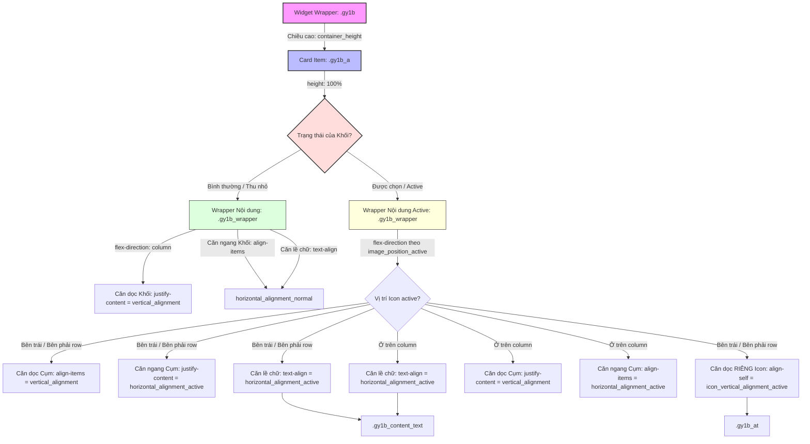

# Sơ đồ Cấu trúc Căn chỉnh Vị trí (Alignment Layout Schema)

Tài liệu này tổng hợp cấu trúc phân cấp Flexbox và mối liên hệ giữa các Control trong Elementor Editor với các thuộc tính CSS, giúp dễ dàng hình dung cơ chế căn chỉnh dọc/ngang của widget Accordion Ngang.

---

## 1. Sơ đồ Phân cấp & Cơ chế Căn chỉnh Flexbox

---

## 2. Chi tiết Ánh xạ Thuộc tính CSS (Properties Mapping)

### A. Trạng thái Card Item tổng quát
| Phần tử HTML | CSS Layout | Thuộc tính điều khiển | Tác dụng |
| :--- | :--- | :--- | :--- |
| `.gy1b` | `display: flex;` | **`container_height`** (Slider) | Quyết định chiều cao cố định của hàng để chống giật màn hình (`CLS`). |
| `.gy1b_a` | `display: flex; flex-direction: column;` | **`vertical_alignment`** (`justify-content`) | Căn chỉnh dọc toàn bộ cụm wrapper bên trong card (Căn trên/giữa/dưới). |

---

### B. Trạng thái Bình thường (Thu nhỏ)
* Hướng Flex: `flex-direction: column;` (Icon nằm trên, Tiêu đề nằm dưới).

| Phần tử HTML | Thuộc tính CSS | Control Elementor | Giá trị & Tác động |
| :--- | :--- | :--- | :--- |
| `.gy1b_wrapper` | `align-items` | **`horizontal_alignment_normal`** | `flex-start` (Trái), `center` (Giữa), `flex-end` (Phải). |
| `.gy1b_wrapper` | `text-align` | **`horizontal_alignment_normal`** | `left` (Trái), `center` (Giữa), `right` (Phải). |

---

### C. Trạng thái Active (Phóng to)
* Hướng Flex: Phụ thuộc vào **`image_position_active`** (`row`, `row-reverse`, hoặc `column`).

#### 1. Khi Vị trí Icon được chọn là `Bên trái` hoặc `Bên phải` (`row` / `row-reverse`)
| Phần tử HTML | Thuộc tính CSS | Control Elementor | Giá trị & Tác động |
| :--- | :--- | :--- | :--- |
| `.gy1b_wrapper` | `align-items` | **`vertical_alignment`** | Căn dọc khối chữ và Icon song song với nhau (`flex-start` / `center` / `flex-end`). |
| `.gy1b_wrapper` | `justify-content` | **`horizontal_alignment_active`** | Căn ngang cụm nội dung (đẩy sát lề hoặc dồn giữa). |
| `.gy1b_content_text` | `text-align` | **`horizontal_alignment_active`** | Căn lề chữ của Tiêu đề và Mô tả (`left` / `center` / `right`). |
| **`.gy1b_at` (Icon)** | **`align-self`** | **`icon_vertical_alignment_active`** | **Căn dọc RIÊNG của Icon** (`flex-start` / `center` / `flex-end`). Giúp Icon ghim đỉnh thẳng hàng dòng Tiêu đề đầu tiên, trong khi khối chữ vẫn trôi ở giữa card. |

#### 2. Khi Vị trí Icon được chọn là `Ở trên` (`column`)
| Phần tử HTML | Thuộc tính CSS | Control Elementor | Giá trị & Tác động |
| :--- | :--- | :--- | :--- |
| `.gy1b_wrapper` | `justify-content` | **`vertical_alignment`** | Căn dọc cụm nội dung so với card. |
| `.gy1b_wrapper` | `align-items` | **`horizontal_alignment_active`** | Căn lề ngang cho cả Icon và Khối chữ (`flex-start` / `center` / `flex-end`). |
| `.gy1b_content_text` | `text-align` | **`horizontal_alignment_active`** | Căn lề text của Tiêu đề và Mô tả (`left` / `center` / `right`). |
