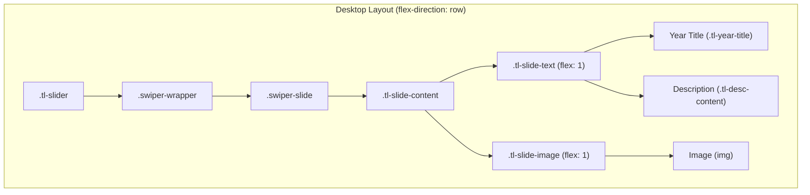
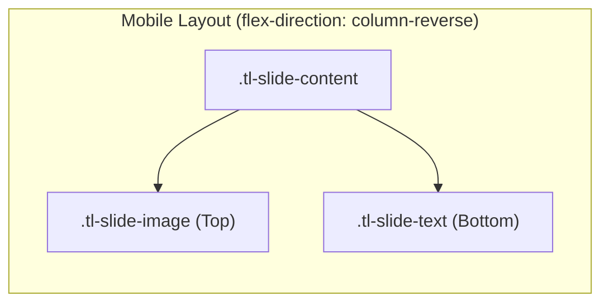

# Hướng dẫn Kỹ thuật: Custom Widget Elementor - Timeline Slider (Slider Dòng thời gian)

Tài liệu này ghi nhận giải pháp phát triển một **Custom Widget Elementor** hiển thị dòng thời gian (timeline) dạng slider với thanh progress bar, dots có text năm, mũi tên điều hướng (arrows), và nội dung 2 cột (văn bản + hình ảnh). Widget sử dụng **Swiper JS** làm engine slider.

---

## 📂 1. Đăng ký Widget trong Theme

Để đăng ký custom widget an toàn trong theme, bạn dán đoạn mã sau vào cuối file [functions.php](file:///d:/xampp/htdocs/bro-tu062026/wp-content/themes/bro-tu/functions.php):

```php
/**
 * Register Custom Elementor Widgets
 */
function bro_tu_register_custom_elementor_widgets( $widgets_manager ) {
    require_once get_stylesheet_directory() . '/inc/elementor-widgets/class-elementor-horizontal-accordion-widget.php';
    $widgets_manager->register( new \Elementor_Horizontal_Accordion_Widget() );

    require_once get_stylesheet_directory() . '/inc/elementor-widgets/class-elementor-timeline-slider-widget.php';
    $widgets_manager->register( new \Elementor_Timeline_Slider_Widget() );
}
add_action( 'elementor/widgets/register', 'bro_tu_register_custom_elementor_widgets' );
```

---

## 📄 2. Mã nguồn Class Widget Elementor

Tệp tin tại đường dẫn: `wp-content/themes/bro-tu/inc/elementor-widgets/class-elementor-timeline-slider-widget.php` chứa toàn bộ code dưới đây:

```php
<?php
if ( ! defined( 'ABSPATH' ) ) {
	exit; // Exit if accessed directly.
}

/**
 * Elementor Timeline Slider Widget.
 *
 * Custom widget hiển thị dòng thời gian (timeline) dạng slider
 * với thanh progress bar, dots có text năm, mũi tên điều hướng,
 * và nội dung 2 cột (văn bản + hình ảnh).
 * Sử dụng Swiper JS làm engine slider.
 */
class Elementor_Timeline_Slider_Widget extends \Elementor\Widget_Base {

	public function get_name() {
		return 'timeline-slider';
	}

	public function get_title() {
		return esc_html__( 'Timeline Slider', 'bro-tu' );
	}

	public function get_icon() {
		return 'eicon-time-line';
	}

	public function get_categories() {
		return [ 'general' ];
	}

	public function get_keywords() {
		return [ 'timeline', 'slider', 'swiper', 'history', 'milestones' ];
	}

	protected function register_controls() {

		/* =====================================================================
		   TAB CONTENT - Nội dung Timeline
		   ===================================================================== */
		$this->start_controls_section(
			'content_section',
			[
				'label' => esc_html__( 'Nội dung Timeline', 'bro-tu' ),
				'tab'   => \Elementor\Controls_Manager::TAB_CONTENT,
			]
		);

		$repeater = new \Elementor\Repeater();

		$repeater->add_control(
			'item_year',
			[
				'label'       => esc_html__( 'Năm (hiển thị trên dot)', 'bro-tu' ),
				'type'        => \Elementor\Controls_Manager::TEXT,
				'default'     => esc_html__( '2011', 'bro-tu' ),
				'label_block' => true,
			]
		);

		$repeater->add_control(
			'item_desc',
			[
				'label'   => esc_html__( 'Mô tả sự kiện', 'bro-tu' ),
				'type'    => \Elementor\Controls_Manager::WYSIWYG,
				'default' => esc_html__( 'Thành lập trụ sở chính tại Thâm Quyến và lập nên các công ty con tại Hồng Kông và Úc.', 'bro-tu' ),
			]
		);

		$repeater->add_control(
			'item_image',
			[
				'label'   => esc_html__( 'Hình ảnh minh họa', 'bro-tu' ),
				'type'    => \Elementor\Controls_Manager::MEDIA,
				'default' => [
					'url' => \Elementor\Utils::get_placeholder_image_src(),
				],
			]
		);

		$this->add_control(
			'timeline_items',
			[
				'label'   => esc_html__( 'Các mốc thời gian', 'bro-tu' ),
				'type'    => \Elementor\Controls_Manager::REPEATER,
				'fields'  => $repeater->get_controls(),
				'default' => [
					[
						'item_year' => esc_html__( '2011', 'bro-tu' ),
						'item_desc' => esc_html__( 'Thành lập trụ sở chính tại Thâm Quyến và lập nên các công ty con tại Hồng Kông và Úc.', 'bro-tu' ),
					],
					[
						'item_year' => esc_html__( '2012', 'bro-tu' ),
						'item_desc' => esc_html__( 'Mở rộng sang thị trường châu Âu và ra mắt dòng sản phẩm biến tần đầu tiên.', 'bro-tu' ),
					],
					[
						'item_year' => esc_html__( '2013', 'bro-tu' ),
						'item_desc' => esc_html__( 'Đạt mốc 1GW công suất biến tần đã lắp đặt trên toàn cầu.', 'bro-tu' ),
					],
					[
						'item_year' => esc_html__( '2014', 'bro-tu' ),
						'item_desc' => esc_html__( 'Ra mắt hệ thống giám sát trực tuyến ShineServer.', 'bro-tu' ),
					],
					[
						'item_year' => esc_html__( '2015', 'bro-tu' ),
						'item_desc' => esc_html__( 'Thành lập trung tâm R&D tại Hợp Phì và mở rộng nhà máy sản xuất.', 'bro-tu' ),
					],
				],
				'title_field' => '{{{ item_year }}}',
			]
		);

		$this->add_control(
			'visible_dots_count',
			[
				'label'   => esc_html__( 'Số lượng dot hiển thị', 'bro-tu' ),
				'type'    => \Elementor\Controls_Manager::NUMBER,
				'default' => 5,
				'min'     => 3,
				'max'     => 12,
				'step'    => 1,
			]
		);

		$this->add_control(
			'autoplay_enabled',
			[
				'label'        => esc_html__( 'Tự động chuyển slide', 'bro-tu' ),
				'type'         => \Elementor\Controls_Manager::SWITCHER,
				'label_on'     => esc_html__( 'Bật', 'bro-tu' ),
				'label_off'    => esc_html__( 'Tắt', 'bro-tu' ),
				'return_value' => 'yes',
				'default'      => '',
				'separator'    => 'before',
			]
		);

		$this->add_control(
			'autoplay_delay',
			[
				'label'     => esc_html__( 'Thời gian chuyển slide (ms)', 'bro-tu' ),
				'type'      => \Elementor\Controls_Manager::NUMBER,
				'default'   => 5000,
				'min'       => 1000,
				'max'       => 15000,
				'step'      => 500,
				'condition' => [
					'autoplay_enabled' => 'yes',
				],
			]
		);

		$this->add_control(
			'slide_speed',
			[
				'label'   => esc_html__( 'Tốc độ chuyển động (ms)', 'bro-tu' ),
				'type'    => \Elementor\Controls_Manager::NUMBER,
				'default' => 500,
				'min'     => 200,
				'max'     => 2000,
				'step'    => 100,
			]
		);

		$this->end_controls_section();

		/* =====================================================================
		   TAB STYLE - Thanh Timeline
		   ===================================================================== */
		$this->start_controls_section(
			'timeline_bar_style_section',
			[
				'label' => esc_html__( 'Thanh Timeline', 'bro-tu' ),
				'tab'   => \Elementor\Controls_Manager::TAB_STYLE,
			]
		);

		$this->add_control(
			'dot_active_color',
			[
				'label'   => esc_html__( 'Màu dot Active', 'bro-tu' ),
				'type'    => \Elementor\Controls_Manager::COLOR,
				'default' => '#6eb92b',
			]
		);

		$this->add_control(
			'dot_inactive_color',
			[
				'label'   => esc_html__( 'Màu dot Inactive', 'bro-tu' ),
				'type'    => \Elementor\Controls_Manager::COLOR,
				'default' => '#b0b0b0',
			]
		);

		$this->add_control(
			'dot_text_color_active',
			[
				'label'   => esc_html__( 'Màu chữ năm (Active)', 'bro-tu' ),
				'type'    => \Elementor\Controls_Manager::COLOR,
				'default' => '#6eb92b',
			]
		);

		$this->add_control(
			'dot_text_color_inactive',
			[
				'label'   => esc_html__( 'Màu chữ năm (Inactive)', 'bro-tu' ),
				'type'    => \Elementor\Controls_Manager::COLOR,
				'default' => '#888888',
			]
		);

		$this->add_group_control(
			\Elementor\Group_Control_Typography::get_type(),
			[
				'name'     => 'dot_text_typography',
				'label'    => esc_html__( 'Typography chữ năm', 'bro-tu' ),
				'selector' => '{{WRAPPER}} .tl-dot-label',
			]
		);

		$this->add_control(
			'progressbar_active_color',
			[
				'label'     => esc_html__( 'Màu Progress đã qua', 'bro-tu' ),
				'type'      => \Elementor\Controls_Manager::COLOR,
				'default'   => '#6eb92b',
				'separator' => 'before',
			]
		);

		$this->add_control(
			'progressbar_inactive_color',
			[
				'label'   => esc_html__( 'Màu Progress chưa qua', 'bro-tu' ),
				'type'      => \Elementor\Controls_Manager::COLOR,
				'default'   => '#d0d0d0',
			]
		);

		$this->add_control(
			'arrow_color',
			[
				'label'     => esc_html__( 'Màu mũi tên', 'bro-tu' ),
				'type'      => \Elementor\Controls_Manager::COLOR,
				'default'   => '#888888',
				'separator' => 'before',
			]
		);

		$this->add_control(
			'arrow_hover_color',
			[
				'label'   => esc_html__( 'Màu mũi tên (Hover)', 'bro-tu' ),
				'type'    => \Elementor\Controls_Manager::COLOR,
				'default' => '#6eb92b',
			]
		);

		$this->end_controls_section();

		/* =====================================================================
		   TAB STYLE - Nội dung Slide
		   ===================================================================== */
		$this->start_controls_section(
			'slide_content_style_section',
			[
				'label' => esc_html__( 'Nội dung Slide', 'bro-tu' ),
				'tab'   => \Elementor\Controls_Manager::TAB_STYLE,
			]
		);

		$this->add_control(
			'year_title_color',
			[
				'label'   => esc_html__( 'Màu tiêu đề năm', 'bro-tu' ),
				'type'    => \Elementor\Controls_Manager::COLOR,
				'default' => '#6eb92b',
			]
		);

		$this->add_group_control(
			\Elementor\Group_Control_Typography::get_type(),
			[
				'name'     => 'year_title_typography',
				'label'    => esc_html__( 'Typography tiêu đề năm', 'bro-tu' ),
				'selector' => '{{WRAPPER}} .tl-year-title',
			]
		);

		$this->add_control(
			'desc_text_color',
			[
				'label'     => esc_html__( 'Màu mô tả', 'bro-tu' ),
				'type'      => \Elementor\Controls_Manager::COLOR,
				'default'   => '#555555',
				'separator' => 'before',
			]
		);

		$this->add_group_control(
			\Elementor\Group_Control_Typography::get_type(),
			[
				'name'     => 'desc_text_typography',
				'label'    => esc_html__( 'Typography mô tả', 'bro-tu' ),
				'selector' => '{{WRAPPER}} .tl-desc-content',
			]
		);

		$this->add_control(
			'slide_bg_color',
			[
				'label'     => esc_html__( 'Màu nền slide', 'bro-tu' ),
				'type'      => \Elementor\Controls_Manager::COLOR,
				'default'   => '#ffffff',
				'separator' => 'before',
			]
		);

		$this->add_control(
			'slide_min_height',
			[
				'label'      => esc_html__( 'Chiều cao tối thiểu slide', 'bro-tu' ),
				'type'       => \Elementor\Controls_Manager::SLIDER,
				'size_units' => [ 'px' ],
				'range'      => [
					'px' => [
						'min' => 200,
						'max' => 800,
					],
				],
				'default'    => [
					'unit' => 'px',
					'size' => 350,
				],
			]
		);

		$this->add_control(
			'slide_border_radius',
			[
				'label'      => esc_html__( 'Bo góc slide', 'bro-tu' ),
				'type'       => \Elementor\Controls_Manager::SLIDER,
				'size_units' => [ 'px' ],
				'range'      => [
					'px' => [
						'min' => 0,
						'max' => 40,
					],
				],
				'default'    => [
					'unit' => 'px',
					'size' => 10,
				],
			]
		);

		$this->add_control(
			'desc_bullet_color',
			[
				'label'     => esc_html__( 'Màu bullet mô tả', 'bro-tu' ),
				'type'      => \Elementor\Controls_Manager::COLOR,
				'default'   => '#6eb92b',
				'separator' => 'before',
			]
		);

		$this->add_responsive_control(
			'content_align',
			[
				'label'     => esc_html__( 'Căn lề ngang', 'bro-tu' ),
				'type'      => \Elementor\Controls_Manager::CHOOSE,
				'options'   => [
					'left'   => [
						'title' => esc_html__( 'Trái (Bắt đầu)', 'bro-tu' ),
						'icon'  => 'eicon-text-align-left',
					],
					'center' => [
						'title' => esc_html__( 'Giữa', 'bro-tu' ),
						'icon'  => 'eicon-text-align-center',
					],
					'right'  => [
						'title' => esc_html__( 'Phải (Kết thúc)', 'bro-tu' ),
						'icon'  => 'eicon-text-align-right',
					],
				],
				'default'   => 'left',
				'selectors' => [
					'{{WRAPPER}} .tl-slide-text' => 'text-align: {{VALUE}};',
				],
			]
		);

		$this->add_responsive_control(
			'content_vertical_align',
			[
				'label'     => esc_html__( 'Căn dọc nội dung', 'bro-tu' ),
				'type'      => \Elementor\Controls_Manager::CHOOSE,
				'options'   => [
					'flex-start' => [
						'title' => esc_html__( 'Trên (Bắt đầu)', 'bro-tu' ),
						'icon'  => 'eicon-v-align-top',
					],
					'center'     => [
						'title' => esc_html__( 'Giữa', 'bro-tu' ),
						'icon'  => 'eicon-v-align-middle',
					],
					'flex-end'   => [
						'title' => esc_html__( 'Dưới (Kết thúc)', 'bro-tu' ),
						'icon'  => 'eicon-v-align-bottom',
					],
				],
				'default'   => 'center',
				'selectors' => [
					'{{WRAPPER}} .tl-slide-text' => 'justify-content: {{VALUE}};',
				],
			]
		);

		$this->end_controls_section();

		/* =====================================================================
		   TAB STYLE - Hình ảnh
		   ===================================================================== */
		$this->start_controls_section(
			'image_style_section',
			[
				'label' => esc_html__( 'Hình ảnh', 'bro-tu' ),
				'tab'   => \Elementor\Controls_Manager::TAB_STYLE,
			]
		);

		$this->add_responsive_control(
			'image_position',
			[
				'label'   => esc_html__( 'Vị trí hình ảnh', 'bro-tu' ),
				'type'    => \Elementor\Controls_Manager::SELECT,
				'default' => 'row',
				'options' => [
					'row'            => esc_html__( 'Phải', 'bro-tu' ),
					'row-reverse'    => esc_html__( 'Trái', 'bro-tu' ),
					'column-reverse' => esc_html__( 'Trên', 'bro-tu' ),
					'column'         => esc_html__( 'Dưới', 'bro-tu' ),
				],
				'selectors' => [
					'{{WRAPPER}} .tl-slide-content' => 'flex-direction: {{VALUE}};',
				],
			]
		);

		$this->add_responsive_control(
			'image_width',
			[
				'label'      => esc_html__( 'Chiều rộng khối ảnh', 'bro-tu' ),
				'type'       => \Elementor\Controls_Manager::SLIDER,
				'size_units' => [ '%', 'px' ],
				'range'      => [
					'%' => [
						'min' => 10,
						'max' => 90,
					],
					'px' => [
						'min' => 100,
						'max' => 800,
					],
				],
				'default'    => [
					'unit' => '%',
					'size' => 50,
				],
				'selectors' => [
					'{{WRAPPER}} .tl-slide-image' => 'width: {{SIZE}}{{UNIT}}; flex: none;',
					'{{WRAPPER}} .tl-slide-text'  => 'width: calc(100% - {{SIZE}}{{UNIT}}); flex: none;',
				],
				'condition' => [
					'image_position' => [ 'row', 'row-reverse' ],
				],
			]
		);

		$this->add_responsive_control(
			'image_height',
			[
				'label'      => esc_html__( 'Chiều cao khối ảnh', 'bro-tu' ),
				'type'       => \Elementor\Controls_Manager::SLIDER,
				'size_units' => [ 'px', 'vh', '%' ],
				'range'      => [
					'px' => [
						'min' => 100,
						'max' => 800,
					],
				],
				'selectors' => [
					'{{WRAPPER}} .tl-slide-image' => 'height: {{SIZE}}{{UNIT}};',
				],
			]
		);

		$this->add_responsive_control(
			'image_padding',
			[
				'label'      => esc_html__( 'Padding khối ảnh', 'bro-tu' ),
				'type'       => \Elementor\Controls_Manager::DIMENSIONS,
				'size_units' => [ 'px', '%', 'em' ],
				'selectors'  => [
					'{{WRAPPER}} .tl-slide-image' => 'padding: {{TOP}}{{UNIT}} {{RIGHT}}{{UNIT}} {{BOTTOM}}{{UNIT}} {{LEFT}}{{UNIT}};',
				],
			]
		);

		$this->add_responsive_control(
			'image_border_radius_control',
			[
				'label'      => esc_html__( 'Bo góc hình ảnh', 'bro-tu' ),
				'type'       => \Elementor\Controls_Manager::SLIDER,
				'size_units' => [ 'px', '%' ],
				'range'      => [
					'px' => [
						'min' => 0,
						'max' => 100,
					],
				],
				'default'    => [
					'unit' => 'px',
					'size' => 8,
				],
				'selectors' => [
					'{{WRAPPER}} .tl-slide-image img' => 'border-radius: {{SIZE}}{{UNIT}};',
				],
			]
		);

		$this->add_control(
			'image_object_fit',
			[
				'label'   => esc_html__( 'Object Fit', 'bro-tu' ),
				'type'    => \Elementor\Controls_Manager::SELECT,
				'default' => 'cover',
				'options' => [
					'cover'   => esc_html__( 'Cover (Đầy)', 'bro-tu' ),
					'contain' => esc_html__( 'Contain (Thu nhỏ vừa khít)', 'bro-tu' ),
					'fill'    => esc_html__( 'Fill (Kéo dãn)', 'bro-tu' ),
				],
				'selectors' => [
					'{{WRAPPER}} .tl-slide-image img' => 'object-fit: {{VALUE}};',
				],
			]
		);

		$this->end_controls_section();
	}

	protected function render() {
		$settings  = $this->get_settings_for_display();
		$items     = $settings['timeline_items'];
		$widget_id = $this->get_id();

		if ( empty( $items ) ) {
			return;
		}

		$count = count( $items );

		// Settings values
		$dot_active        = $settings['dot_active_color'];
		$dot_inactive      = $settings['dot_inactive_color'];
		$dot_text_active   = $settings['dot_text_color_active'];
		$dot_text_inactive = $settings['dot_text_color_inactive'];
		$prog_active       = $settings['progressbar_active_color'];
		$prog_inactive     = $settings['progressbar_inactive_color'];
		$arrow_color       = $settings['arrow_color'];
		$arrow_hover       = $settings['arrow_hover_color'];
		$year_color        = $settings['year_title_color'];
		$desc_color        = $settings['desc_text_color'];
		$slide_bg          = $settings['slide_bg_color'];
		$slide_min_h       = ! empty( $settings['slide_min_height']['size'] ) ? $settings['slide_min_height']['size'] : 350;
		$slide_radius      = ! empty( $settings['slide_border_radius']['size'] ) ? $settings['slide_border_radius']['size'] : 10;
		$bullet_color      = $settings['desc_bullet_color'];
		$autoplay          = $settings['autoplay_enabled'] === 'yes';
		$autoplay_delay    = ! empty( $settings['autoplay_delay'] ) ? $settings['autoplay_delay'] : 5000;
		$speed             = ! empty( $settings['slide_speed'] ) ? $settings['slide_speed'] : 500;
		?>

		<style>
			/* ============================================================
			   SCOPED CSS - Timeline Slider <?php echo esc_attr( $widget_id ); ?>
			   ============================================================ */
			.tl-slider-<?php echo esc_attr( $widget_id ); ?> {
				position: relative;
				width: 100%;
				overflow: hidden;
			}

			/* --- Swiper Slides --- */
			.tl-slider-<?php echo esc_attr( $widget_id ); ?> .swiper-slide {
				background: <?php echo esc_attr( $slide_bg ); ?>;
				min-height: <?php echo esc_attr( $slide_min_h ); ?>px;
				border-radius: <?php echo esc_attr( $slide_radius ); ?>px;
				overflow: hidden;
			}

			.tl-slider-<?php echo esc_attr( $widget_id ); ?> .tl-slide-content {
				display: flex;
				align-items: stretch;
				width: 100%;
				min-height: <?php echo esc_attr( $slide_min_h ); ?>px;
			}

			.tl-slider-<?php echo esc_attr( $widget_id ); ?> .tl-slide-text {
				flex: 1;
				padding: 40px 35px;
				display: flex;
				flex-direction: column;
				justify-content: center;
				transition: all 0.3s ease;
			}

			.tl-slider-<?php echo esc_attr( $widget_id ); ?> .tl-slide-image {
				flex: 1;
				position: relative;
				overflow: hidden;
				transition: all 0.3s ease;
			}

			.tl-slider-<?php echo esc_attr( $widget_id ); ?> .tl-slide-image img {
				width: 100%;
				height: 100%;
				object-fit: cover;
				display: block;
				transition: all 0.3s ease;
			}

			.tl-slider-<?php echo esc_attr( $widget_id ); ?> .tl-year-title {
				color: <?php echo esc_attr( $year_color ); ?>;
				font-size: 64px;
				font-weight: 800;
				line-height: 1;
				margin: 0 0 25px 0;
				letter-spacing: -1px;
			}

			.tl-slider-<?php echo esc_attr( $widget_id ); ?> .tl-desc-content {
				color: <?php echo esc_attr( $desc_color ); ?>;
				font-size: 15px;
				line-height: 1.7;
			}

			.tl-slider-<?php echo esc_attr( $widget_id ); ?> .tl-desc-content ul {
				list-style: none;
				padding: 0;
				margin: 0;
			}

			.tl-slider-<?php echo esc_attr( $widget_id ); ?> .tl-desc-content li {
				position: relative;
				padding-left: 22px;
				margin-bottom: 8px;
			}

			.tl-slider-<?php echo esc_attr( $widget_id ); ?> .tl-desc-content li::before {
				content: "";
				position: absolute;
				left: 0;
				top: 8px;
				width: 8px;
				height: 8px;
				border-radius: 50%;
				background-color: <?php echo esc_attr( $bullet_color ); ?>;
			}

			/* Fade effect cho title trong slide */
			.tl-slider-<?php echo esc_attr( $widget_id ); ?> .swiper-slide .tl-year-title,
			.tl-slider-<?php echo esc_attr( $widget_id ); ?> .swiper-slide .tl-desc-content {
				opacity: 0;
				transform: translateY(15px);
				transition: opacity 0.5s ease 0.3s, transform 0.5s ease 0.3s;
			}
			.tl-slider-<?php echo esc_attr( $widget_id ); ?> .swiper-slide-active .tl-year-title,
			.tl-slider-<?php echo esc_attr( $widget_id ); ?> .swiper-slide-active .tl-desc-content {
				opacity: 1;
				transform: translateY(0);
			}
			.tl-slider-<?php echo esc_attr( $widget_id ); ?> .swiper-slide-active .tl-desc-content {
				transition-delay: 0.45s;
			}

			/* --- Timeline Bar --- */
			.tl-slider-<?php echo esc_attr( $widget_id ); ?> .tl-timeline-bar {
				position: relative;
				display: flex;
				align-items: center;
				margin-top: 40px;
				padding: 0 45px;
			}

			/* Arrow buttons */
			.tl-slider-<?php echo esc_attr( $widget_id ); ?> .tl-arrow {
				position: absolute;
				top: 50%;
				transform: translateY(-50%);
				width: 32px;
				height: 32px;
				cursor: pointer;
				display: flex;
				align-items: center;
				justify-content: center;
				z-index: 10;
				transition: all 0.3s ease;
				border: 1px solid <?php echo esc_attr( $arrow_color ); ?>;
				border-radius: 50%;
				background: transparent;
				padding: 0;
			}

			.tl-slider-<?php echo esc_attr( $widget_id ); ?> .tl-arrow:hover {
				border-color: <?php echo esc_attr( $arrow_hover ); ?>;
			}

			.tl-slider-<?php echo esc_attr( $widget_id ); ?> .tl-arrow svg {
				width: 14px;
				height: 14px;
				fill: none;
				stroke: <?php echo esc_attr( $arrow_color ); ?>;
				stroke-width: 2;
				stroke-linecap: round;
				stroke-linejoin: round;
				transition: stroke 0.3s ease;
			}

			.tl-slider-<?php echo esc_attr( $widget_id ); ?> .tl-arrow:hover svg {
				stroke: <?php echo esc_attr( $arrow_hover ); ?>;
			}

			.tl-slider-<?php echo esc_attr( $widget_id ); ?> .tl-arrow-prev {
				left: 0;
			}

			.tl-slider-<?php echo esc_attr( $widget_id ); ?> .tl-arrow-next {
				right: 0;
			}

			/* Dots container */
			.tl-slider-<?php echo esc_attr( $widget_id ); ?> .tl-dots-track {
				position: relative;
				flex: 1;
				display: flex;
				align-items: center;
				height: 60px;
			}

			/* Progress line (background) */
			.tl-slider-<?php echo esc_attr( $widget_id ); ?> .tl-progress-line {
				position: absolute;
				top: 50%;
				left: 6px; /* Offset by half of dot item width (12px / 2 = 6px) to align exactly with circle centers */
				right: 6px;
				height: 2px;
				background: <?php echo esc_attr( $prog_inactive ); ?>;
				transform: translateY(-50%);
				z-index: 1;
			}

			/* Progress fill */
			.tl-slider-<?php echo esc_attr( $widget_id ); ?> .tl-progress-fill {
				position: absolute;
				top: 0;
				left: 0;
				height: 100%;
				width: 0%;
				background: <?php echo esc_attr( $prog_active ); ?>;
				transition: width 0.5s cubic-bezier(0.25, 1, 0.5, 1);
			}

			/* Dot items */
			.tl-slider-<?php echo esc_attr( $widget_id ); ?> .tl-dots-list {
				position: relative;
				list-style: none;
				margin: 0;
				padding: 0;
				display: flex;
				justify-content: space-between;
				align-items: center; /* Center dots vertically relative to the progress line */
				width: 100%;
				z-index: 2;
			}

			.tl-slider-<?php echo esc_attr( $widget_id ); ?> .tl-dot-item {
				position: relative;
				width: 12px; /* Set fixed width matching the circle diameter to define a precise layout boundary */
				height: 12px;
				display: flex;
				justify-content: center;
				align-items: center;
				cursor: pointer;
				flex-shrink: 0; /* Prevent the flex track from shrinking the dot container */
				transition: all 0.3s ease;
			}

			.tl-slider-<?php echo esc_attr( $widget_id ); ?> .tl-dot-label {
				position: absolute;
				bottom: 24px; /* Position Year label above the circle, out of flow to prevent it from shifting the dot container */
				left: 50%;
				transform: translateX(-50%);
				font-size: 14px;
				font-weight: 600;
				color: <?php echo esc_attr( $dot_text_inactive ); ?>;
				transition: all 0.3s ease;
				white-space: nowrap;
				user-select: none;
			}

			.tl-slider-<?php echo esc_attr( $widget_id ); ?> .tl-dot-circle {
				width: 12px;
				height: 12px;
				border-radius: 50%;
				background: <?php echo esc_attr( $dot_inactive ); ?>;
				flex-shrink: 0; /* Prevent the flex container from squishing the circle when expanding to 18px */
				transition: all 0.4s cubic-bezier(0.25, 1, 0.5, 1);
				position: relative;
			}

			/* Active dot */
			.tl-slider-<?php echo esc_attr( $widget_id ); ?> .tl-dot-item.active .tl-dot-label {
				color: <?php echo esc_attr( $dot_text_active ); ?>;
				font-weight: 700;
			}

			.tl-slider-<?php echo esc_attr( $widget_id ); ?> .tl-dot-item.active .tl-dot-circle {
				width: 18px;
				height: 18px;
				background: transparent;
				border: 3px solid <?php echo esc_attr( $dot_active ); ?>;
			}

			/* Dots sau active → inactive */
			.tl-slider-<?php echo esc_attr( $widget_id ); ?> .tl-dot-item.passed .tl-dot-circle {
				background: <?php echo esc_attr( $dot_active ); ?>;
			}
			.tl-slider-<?php echo esc_attr( $widget_id ); ?> .tl-dot-item.passed .tl-dot-label {
				color: <?php echo esc_attr( $dot_text_inactive ); ?>;
			}

			/* --- Responsive --- */
			@media (max-width: 767px) {
				.tl-slider-<?php echo esc_attr( $widget_id ); ?> .tl-slide-content {
					flex-direction: column-reverse;
				}
				.tl-slider-<?php echo esc_attr( $widget_id ); ?> .tl-slide-text,
				.tl-slider-<?php echo esc_attr( $widget_id ); ?> .tl-slide-image {
					width: 100%;
					flex: none;
				}
				.tl-slider-<?php echo esc_attr( $widget_id ); ?> .tl-slide-image {
					min-height: 200px;
					height: 250px;
				}
				.tl-slider-<?php echo esc_attr( $widget_id ); ?> .tl-slide-text {
					padding: 25px 20px;
				}
				.tl-slider-<?php echo esc_attr( $widget_id ); ?> .tl-year-title {
					font-size: 40px !important;
					margin-bottom: 15px;
				}
				.tl-slider-<?php echo esc_attr( $widget_id ); ?> .tl-timeline-bar {
					margin-top: 25px;
					padding: 0 35px;
				}
				.tl-slider-<?php echo esc_attr( $widget_id ); ?> .tl-dot-label {
					font-size: 11px !important;
				}
			}

			@media (max-width: 480px) {
				.tl-slider-<?php echo esc_attr( $widget_id ); ?> .tl-timeline-bar {
					padding: 0 30px;
				}
				.tl-slider-<?php echo esc_attr( $widget_id ); ?> .tl-dot-label {
					font-size: 10px !important;
				}
			}
		</style>

		<div class="tl-slider tl-slider-<?php echo esc_attr( $widget_id ); ?>">

			<!-- Swiper Container -->
			<div class="swiper tl-swiper-<?php echo esc_attr( $widget_id ); ?>">
				<div class="swiper-wrapper">
					<?php foreach ( $items as $index => $item ) : ?>
						<div class="swiper-slide">
							<div class="tl-slide-content">
								<!-- Cột trái: Nội dung -->
								<div class="tl-slide-text">
									<?php if ( ! empty( $item['item_year'] ) ) : ?>
										<h3 class="tl-year-title"><?php echo esc_html( $item['item_year'] ); ?></h3>
									<?php endif; ?>
									<?php if ( ! empty( $item['item_desc'] ) ) : ?>
										<div class="tl-desc-content">
											<?php echo wp_kses_post( $item['item_desc'] ); ?>
										</div>
									<?php endif; ?>
								</div>
								<!-- Cột phải: Hình ảnh -->
								<?php if ( ! empty( $item['item_image']['url'] ) ) : ?>
									<div class="tl-slide-image">
										" alt="<?php echo esc_attr( $item['item_year'] ); ?>">
									</div>
								<?php endif; ?>
							</div>
						</div>
					<?php endforeach; ?>
				</div>
			</div>

			<!-- Timeline Bar -->
			<div class="tl-timeline-bar">
				<!-- Arrow Prev -->
				<button class="tl-arrow tl-arrow-prev tl-prev-<?php echo esc_attr( $widget_id ); ?>" aria-label="Previous">
					<svg viewBox="0 0 24 24"><polyline points="15 18 9 12 15 6"></polyline></svg>
				</button>

				<!-- Dots Track -->
				<div class="tl-dots-track">
					<!-- Progress Line -->
					<div class="tl-progress-line">
						<div class="tl-progress-fill tl-progress-fill-<?php echo esc_attr( $widget_id ); ?>"></div>
					</div>
					<!-- Dot Items -->
					<ul class="tl-dots-list tl-dots-list-<?php echo esc_attr( $widget_id ); ?>">
						<?php foreach ( $items as $index => $item ) : ?>
							<li class="tl-dot-item<?php echo ( $index === 0 ) ? ' active' : ''; ?>" data-index="<?php echo esc_attr( $index ); ?>">
								<span class="tl-dot-label"><?php echo esc_html( $item['item_year'] ); ?></span>
								<span class="tl-dot-circle"></span>
							</li>
						<?php endforeach; ?>
					</ul>
				</div>

				<!-- Arrow Next -->
				<button class="tl-arrow tl-arrow-next tl-next-<?php echo esc_attr( $widget_id ); ?>" aria-label="Next">
					<svg viewBox="0 0 24 24"><polyline points="9 18 15 12 9 6"></polyline></svg>
				</button>
			</div>
		</div>

		<script>
		(function() {
			function initTimelineSlider_<?php echo esc_attr( $widget_id ); ?>() {
				var widgetId = '<?php echo esc_js( $widget_id ); ?>';
				var swiperEl = document.querySelector('.tl-swiper-' + widgetId);
				if (!swiperEl) return;

				var totalSlides = <?php echo intval( $count ); ?>;
				var visibleDots = <?php echo intval( $settings['visible_dots_count'] ); ?>;
				var dotItems = document.querySelectorAll('.tl-dots-list-' + widgetId + ' .tl-dot-item');
				var progressFill = document.querySelector('.tl-progress-fill-' + widgetId);

				var currentStart = 0;
				var triggerType = 'init'; // 'init', 'arrow', 'dot'

				function updateTimeline(activeIndex) {
					// 1. Calculate the sliding window range
					if (triggerType === 'arrow') {
						if (activeIndex === 0) {
							currentStart = 0;
						} else if (activeIndex === totalSlides - 1) {
							currentStart = Math.max(0, totalSlides - visibleDots);
						} else {
							// Shift window so that activeIndex becomes the first dot of the visible window
							// But don't exceed the right-most limit (totalSlides - visibleDots)
							currentStart = Math.min(activeIndex, Math.max(0, totalSlides - visibleDots));
						}
					} else if (triggerType === 'init') {
						currentStart = 0;
					}
					// If triggerType === 'dot', currentStart does not change!

					// Reset triggerType back to arrow for future automatic slide changes
					triggerType = 'arrow';

					// 2. Hide/Show dots based on sliding window
					dotItems.forEach(function(dot, i) {
						dot.classList.remove('active', 'passed');
						
						if (i >= currentStart && i < currentStart + visibleDots) {
							dot.style.display = 'flex';
						} else {
							dot.style.display = 'none';
						}

						if (i === activeIndex) {
							dot.classList.add('active');
						} else if (i < activeIndex) {
							dot.classList.add('passed');
						}
					});

					// 3. Update Progress Bar relative to the visible window
					if (totalSlides > 1 && progressFill) {
						var actualVisibleDots = Math.min(totalSlides, visibleDots);
						var relativeActiveIndex = activeIndex - currentStart;
						var percent = (actualVisibleDots > 1) ? (relativeActiveIndex / (actualVisibleDots - 1)) * 100 : 0;
						progressFill.style.width = percent + '%';
					}
				}

				var swiperConfig = {
					autoHeight: false,
					speed: <?php echo intval( $speed ); ?>,
					direction: 'horizontal',
					loop: false,
					effect: 'slide',
					spaceBetween: 30,
					allowTouchMove: true,
					on: {
						init: function() {
							triggerType = 'init';
							updateTimeline(0);
						},
						slideChangeTransitionStart: function() {
							// If not already set to 'dot', treat as arrow/swipe transition
							updateTimeline(this.realIndex);
						}
					}
				};

				<?php if ( $autoplay ) : ?>
				swiperConfig.autoplay = {
					delay: <?php echo intval( $autoplay_delay ); ?>,
					disableOnInteraction: false
				};
				<?php endif; ?>

				var swiper = new Swiper('.tl-swiper-' + widgetId, swiperConfig);

				// Dot click handler
				dotItems.forEach(function(dot) {
					dot.addEventListener('click', function() {
						var idx = parseInt(this.getAttribute('data-index'), 10);
						triggerType = 'dot';
						swiper.slideTo(idx);
					});
				});

				// Arrow handlers
				var prevBtn = document.querySelector('.tl-prev-' + widgetId);
				var nextBtn = document.querySelector('.tl-next-' + widgetId);

				if (prevBtn) {
					prevBtn.addEventListener('click', function() {
						triggerType = 'arrow';
						if (swiper.realIndex === 0) {
							// Wrap around to the last slide
							swiper.slideTo(totalSlides - 1);
						} else {
							swiper.slidePrev();
						}
					});
				}
				if (nextBtn) {
					nextBtn.addEventListener('click', function() {
						triggerType = 'arrow';
						if (swiper.realIndex === totalSlides - 1) {
							// Wrap around to the first slide
							swiper.slideTo(0);
						} else {
							swiper.slideNext();
						}
					});
				}
			}

			// Initialize: support both frontend and Elementor editor
			if (document.readyState === 'loading') {
				document.addEventListener('DOMContentLoaded', initTimelineSlider_<?php echo esc_attr( $widget_id ); ?>);
			} else {
				initTimelineSlider_<?php echo esc_attr( $widget_id ); ?>();
			}

			// Re-init when Elementor frontend handler fires
			if (typeof jQuery !== 'undefined') {
				jQuery(window).on('elementor/frontend/init', function() {
					if (typeof elementorFrontend !== 'undefined') {
						elementorFrontend.hooks.addAction('frontend/element_ready/timeline-slider.default', function() {
							initTimelineSlider_<?php echo esc_attr( $widget_id ); ?>();
						});
					}
				});
			}
		})();
		</script>
		<?php
	}
}
```

---

## ⚡ 3. Giải pháp Hiệu ứng chuyển động (Micro-interactions) & CSS
- **Scoping theo ID**: Tạo ID CSS động `.tl-slider-<?php echo esc_attr( $widget_id ); ?>` giúp chèn nhiều slide timeline trên cùng một trang mà không bị xung đột style.
- **Progress Line & Fill**:
  - Thanh xám làm nền nằm tuyệt đối ở tâm trục ngang (`top: 50%`, `transform: translateY(-50%)`).
  - Thanh fill xanh (`.tl-progress-fill`) thay đổi chiều rộng (`width`) mượt mà qua thuộc tính transition dựa trên tỷ lệ vị trí của active dot so với các dot đang hiển thị trong cửa sổ trượt: `((activeIndex - currentStart) / (actualVisibleDots - 1)) * 100%`.
- **Phân tách trạng thái Dot**:
  - Trạng thái Active: `.active` vẽ vòng tròn xanh rỗng viền lớn (`border: 3px solid #6eb92b`), text năm active chuyển xanh.
  - Trạng thái Đã qua: `.passed` vẽ chấm tròn xanh đặc (`background: #6eb92b`), text năm trở lại màu xám.
  - Trạng thái Chưa tới: Chấm tròn và text năm có màu xám mặc định.
- **Fade-In Nội dung**: Trì hoãn hiển thị văn bản mô tả sau tiêu đề năm bằng cách chia thời gian delay khác nhau (`transition-delay: 0.3s` cho tiêu đề và `0.45s` cho nội dung mô tả) khi class `.swiper-slide-active` được kích hoạt.

---

## 🎨 4. Sơ đồ Cấu trúc & Căn chỉnh Giao diện (Layout Positioning Diagram)

### 4.1 Bố cục cột slide (Desktop & Mobile)





### 4.2 Sơ đồ khối thanh Timeline và Cửa sổ trượt (Sliding Window)

```
========================================================================================
                          TIMELINE BAR & SLIDING WINDOW DIAGRAM
========================================================================================

 [.tl-timeline-bar] (padding: 0 45px; position: relative;)
 --------------------------------------------------------------------------------------
 |                                                                                    |
 |  [Prev Arrow]                [ Dots Track (.tl-dots-track) ]          [Next Arrow] |
 |  (.tl-arrow-prev)           (position: relative; flex: 1)           (.tl-arrow-next)
 |                              |                                                     |
 |                              +-- [.tl-progress-line] (height: 2px; bg: grey; z: 1) |
 |                              |   |                                                 |
 |                              |   +-- [.tl-progress-fill] (width: X%; bg: green)    |
 |                              |                                                     |
 |                              +-- [.tl-dots-list] (flex; space-between; z: 2)       |
 |                                  |                                                 |
 |                                  |  <- Sliding Window (display: flex) ->           |
 |                                  +-- [Dot 3]  [Dot 4]  [Dot 5]  [Dot 6]  [Dot 7]   |
 |                                  |   (passed) (passed) (active) (future) (future)  |
 |                                  |                                                 |
 |                                  |  <- Hidden (display: none) ------------------>  |
 |                                  +-- [Dot 1]  [Dot 2]  ...  [Dot 12] [Dot 13]      |
 |                                                                                    |
 --------------------------------------------------------------------------------------

========================================================================================
                          DOT ITEM STRUCTURE & ALIGNMENT
========================================================================================

 [.tl-dot-item] (flex-direction: column; align-items: center; cursor: pointer;)
 -----------------------------------------------------------
 |                                                         |
 |  Year text:     "2011" (.tl-dot-label)                 |
 |                    |                                    |
 |  Margin-bottom:   (12px)                                |
 |                    |                                    |
 |  Circle:           O   (.tl-dot-circle)                 |
 |                    |                                    |
 |  Alignment:     Center-aligned to progress line        |
 |                                                         |
 -----------------------------------------------------------
```
