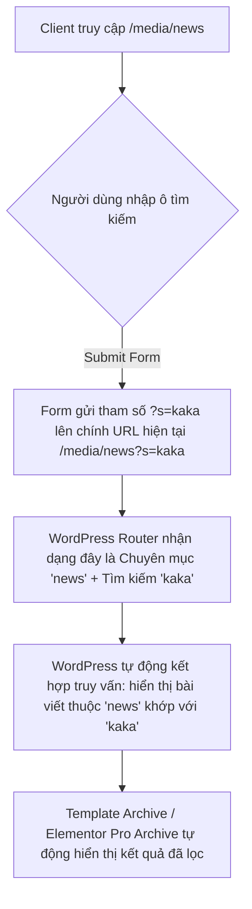

# Luồng Xử lý: Đồng bộ Đường dẫn & Tìm kiếm Danh mục Growatt (Tham số s mặc định)

Tài liệu này phân tích và thiết lập luồng xử lý kỹ thuật để đồng bộ đường dẫn danh mục và chức năng tìm kiếm bài viết sử dụng tham số `s` mặc định của WordPress trong trang danh mục (Archive / Elementor Pro Archive) của phân hệ Growatt.

---

## 1. Phân tích vấn đề (Problem Analysis)

### Vấn đề 1: Cấu trúc đường dẫn (URL Rewrite Structure)
* **Hiện trạng của dự án**: `/category/tin-tuc/` (sử dụng category base mặc định `category` và slug `tin-tuc`).
* **Đường dẫn web mẫu**: `/media/news` (sử dụng tiền tố `media` và slug danh mục `news`).
* **Giải pháp**:
  1. Vào **Settings > Permalinks** -> Đổi Category base từ `category` thành `media`.
  2. Vào **Posts > Categories** -> Đổi slug của chuyên mục `Tin tức` thành `news`.

### Vấn đề 2: Chức năng tìm kiếm trong cùng danh mục
* **Yêu cầu**: 
  * Khi ở trang danh mục `/media/news`, tìm kiếm từ khóa `kaka` thì URL chuyển sang `/media/news?s=kaka`.
  * Giao diện hiển thị kết quả tìm kiếm vẫn giữ nguyên layout của trang danh mục đó, chỉ lọc các bài viết khớp với từ khóa.
* **Nguyên nhân cản trở mặc định**:
  * Form tìm kiếm mặc định của WordPress submit về URL root `/` làm mất tiền tố `/media/news/`.

---

## 2. Giải pháp xử lý sử dụng tham số `s` mặc định

Khi sử dụng tham số tìm kiếm mặc định `s` của WordPress kết hợp với gửi trực tiếp lên URL danh mục hiện tại, **WordPress Core sẽ tự động gộp hai điều kiện truy vấn**:
1. Lọc theo danh mục: `category_name => 'news'`
2. Lọc theo từ khóa: `s => 'kaka'`

Do đó, **không cần viết bất kỳ đoạn code hook PHP (`pre_get_posts` hoặc elementor query) ở backend**. Hệ thống sẽ tự động lọc các bài viết thỏa mãn yêu cầu và hiển thị trên giao diện danh mục hiện có.



---

## 3. Quy trình thực hiện chi tiết

### A. Đối với Code PHP Template (Nếu không dùng Elementor)
Trong file template hiển thị danh mục (`archive.php` hoặc `category-news.php`), chèn form tìm kiếm HTML tùy biến:
```html
<form role="search" method="get" class="news-search-form" action="<?php echo esc_url( get_category_link( get_queried_object_id() ) ); ?>">
    <div class="search-wrapper" style="display: flex; gap: 10px;">
        <input type="text" name="s" value="<?php echo get_search_query(); ?>" placeholder="Tìm kiếm bài viết..." class="form-control">
        <button type="submit" class="btn btn-success">Tìm kiếm</button>
    </div>
</form>
```
* **Giải thích**: `action` trỏ thẳng tới link chuyên mục hiện tại. Khi submit, trình duyệt sẽ điều hướng tới `/media/news?s=từ-khóa`.

### B. Đối với Elementor Pro Archive Template (Khi dùng Elementor để kéo giao diện)

Khi thiết kế giao diện Archive bằng Elementor Pro (sử dụng widget **Archive Posts** kế thừa Main Query):

#### Lựa chọn 1: Sử dụng Widget Search Form mặc định của Elementor Pro (Khuyên dùng)
Bạn hoàn toàn có thể kéo thả widget **Search Form** mặc định của Elementor Pro để tùy biến thiết kế (thay vì kéo widget HTML). Tuy nhiên, mặc định widget này luôn submit về trang chủ (`action="http://your-domain/"`).
Để bắt nó submit lên chính trang danh mục hiện tại:
1. Kéo thả widget **Search Form** của Elementor Pro vào giao diện.
2. Thêm một widget **HTML** nhỏ bên cạnh (hoặc chèn script vào chân trang) chứa đoạn mã Javascript sau để thay đổi thuộc tính `action` của form tìm kiếm:
   ```html
   <script>
   document.addEventListener("DOMContentLoaded", function() {
       // 1. Tìm form tìm kiếm mặc định của Elementor Pro
       const elementorSearchForm = document.querySelector('.elementor-search-form');
       if (elementorSearchForm) {
           // Đổi action từ trang chủ thành chính đường dẫn danh mục hiện tại (ví dụ: /media/news)
           elementorSearchForm.setAttribute('action', window.location.pathname);
       }
       
       // 2. Tự động giữ lại từ khóa tìm kiếm trong ô input sau khi tải trang
       const urlParams = new URLSearchParams(window.location.search);
       const searchKey = urlParams.get('s');
       if (searchKey) {
           const searchInput = elementorSearchForm.querySelector('input[type="search"]');
           if (searchInput) {
               searchInput.value = searchKey;
           }
       }
   });
   </script>
   ```

---

#### Lựa chọn 2: Tự tạo thanh tìm kiếm thủ công bằng Widget HTML
Nếu bạn muốn tự do cấu hình cấu trúc HTML mà không dùng widget có sẵn:
1. Kéo thả widget **HTML** của Elementor vào vị trí muốn đặt thanh tìm kiếm.
2. Nhập đoạn code HTML và JS sau:
   ```html
   <form role="search" method="get" class="elementor-search-form" action="">
       <div class="search-wrapper" style="display: flex; gap: 10px;">
           <input type="text" id="news-search-input" name="s" placeholder="Tìm kiếm bài viết..." class="form-control" style="flex: 1; padding: 10px 15px; border-radius: 8px; border: 1px solid #e2e8f0;">
           <button type="submit" class="btn-search" style="padding: 10px 25px; border-radius: 8px; background-color: #6eb92b; color: white; border: none; font-weight: bold; cursor: pointer;">Tìm kiếm</button>
       </div>
   </form>

   <script>
   document.addEventListener("DOMContentLoaded", function() {
       // Tự động điền lại từ khóa cũ từ tham số 's' trên URL vào ô input khi load trang
       const urlParams = new URLSearchParams(window.location.search);
       const searchKey = urlParams.get('s');
       if (searchKey) {
           const searchInput = document.getElementById('news-search-input');
           if (searchInput) {
               searchInput.value = searchKey;
           }
       }
   });
   </script>
   ```

* **Tại sao cách này hoạt động hoàn hảo mà không cần code PHP?**
  * `action=""` giúp form tự động submit lên chính URL trang danh mục hiện tại.
  * Tên input là `s` (`name="s"`) là tham số mặc định của WordPress.
  * Widget **Archive Posts** của Elementor Pro tự động tải Main Query của WordPress. Khi nhận URL chứa `/media/news?s=kaka`, WordPress tự động gộp bộ lọc chuyên mục và tìm kiếm, trả về danh sách bài viết đã lọc cho Elementor render.
