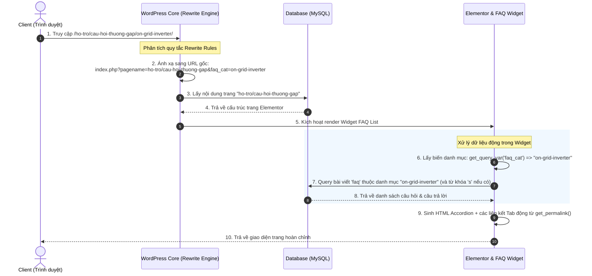

# Luồng xử lý và Kiến trúc Hệ thống FAQ (Câu Hỏi Thường Gặp)

Tài liệu này mô tả chi tiết luồng xử lý định tuyến (Routing) và cơ chế hiển thị động (Rendering) của phân hệ **Câu Hỏi Thường Gặp** trên trang Hỗ trợ của website Growatt.

---

## 1. Cấu trúc Trang & Dữ liệu
* **Trang tĩnh gốc (Pages)**: Trang chủ quản lý có URL `/ho-tro/cau-hoi-thuong-gap/` (được thiết kế tùy biến bằng Elementor và kéo thả widget `Growatt FAQ List`).
* **Danh mục con (Virtual Routes)**: Các đường dẫn con dạng `/ho-tro/cau-hoi-thuong-gap/{slug-danh-muc}/` (ví dụ: `/ho-tro/cau-hoi-thuong-gap/on-grid-inverter/`) là các **đường dẫn ảo**. Chúng không tồn tại dưới dạng trang thực trong database mà được định tuyến động.
* **Custom Post Type & Taxonomy**:
  - CPT: `faq` (quản lý câu hỏi & câu trả lời).
  - Taxonomy: `faq_category` (quản lý nhóm thiết bị như biến tần nối lưới, lưu trữ...).

---

## 2. Sơ đồ tuần tự xử lý Request (Request Lifecycle)



---

## 3. Cấu hình định tuyến chi tiết (Routing Configuration)

Định tuyến được thiết lập trong tệp [functions.php](file:///d:/xampp/htdocs/bro-tu062026/wp-content/themes/bro-tu/functions.php):

### 3.1. Đăng ký biến truy vấn `faq_cat`
Đăng ký biến truy vấn tùy chỉnh để tránh bị WordPress tự động lược bỏ khi phân tích URL:
```php
add_filter( 'query_vars', 'bro_tu_add_faq_query_vars' );
function bro_tu_add_faq_query_vars( $vars ) {
	$vars[] = 'faq_cat';
	return $vars;
}
```

### 3.2. Quy tắc ghi đè đường dẫn (Rewrite Rules)
Khai báo ánh xạ đường dẫn ảo cấp 2 và cấp 3 (phân trang) về trang tĩnh gốc:
```php
add_action( 'init', 'bro_tu_faq_rewrite_rules' );
function bro_tu_faq_rewrite_rules() {
	// Quy tắc phân trang của danh mục con
	add_rewrite_rule(
		'^ho-tro/cau-hoi-thuong-gap/([^/]+)/page/([0-9]+)/?',
		'index.php?pagename=ho-tro/cau-hoi-thuong-gap&faq_cat=$matches[1]&paged=$matches[2]',
		'top'
	);
	// Quy tắc danh mục con
	add_rewrite_rule(
		'^ho-tro/cau-hoi-thuong-gap/([^/]+)/?',
		'index.php?pagename=ho-tro/cau-hoi-thuong-gap&faq_cat=$matches[1]',
		'top'
	);
}
```
*Lưu ý: Sau khi thay đổi quy tắc này, quản trị viên cần vào **Settings -> Permalinks** và nhấn **Save Changes** để WordPress ghi lại file `.htaccess` (Flush Rewrite Rules).*

---

## 4. Cơ chế hoạt động của Widget Elementor (`Growatt FAQ List`)

### 4.1. Lấy dữ liệu & Đọc danh mục hiện tại
Trong phương thức `render()`, widget xác định danh mục cần lọc bằng cách:
1. Đọc biến `faq_cat` trên URL qua `get_query_var( 'faq_cat' )`.
2. Nếu rỗng (người dùng truy cập trang tổng không kèm danh mục), tự động lấy danh mục con đầu tiên được cấu hình trong hệ thống làm mặc định.
3. Sử dụng `WP_Query` lọc bài viết `post_type => 'faq'` khớp với danh mục và từ khóa tìm kiếm `$_GET['s']`.

### 4.2. Sinh đường dẫn liên kết (Dynamic Permalink Generation)
Để đảm bảo widget chạy độc lập trên mọi môi trường và mọi tên miền (Local, Staging, Production) mà không bị hardcode URL:
- Sử dụng hàm `get_permalink()` để lấy URL trang tĩnh cha hiện tại.
- Sinh link các tab danh mục con động:
  ```php
  $clean_page_url = rtrim( $current_page_url, '/' );
  $term_link = user_trailingslashit( $clean_page_url . '/' . $term->slug );
  ```

---

## 5. Giải pháp tối ưu hóa Frontend (CSS & JS)

### 5.1. Khắc phục lỗi đóng/mở Accordion
- Do một số trang không enqueue thư viện Bootstrap JS đầy đủ dẫn đến lỗi thuộc tính `data-bs-toggle` không hoạt động.
- **Giải pháp**: Nhúng trực tiếp đoạn mã jQuery xử lý đóng mở thủ công ở chân widget:
  - Lắng nghe click tại `.accordion-button`.
  - Sử dụng `.slideDown(200)` và `.slideUp(200)` để tạo hiệu ứng chuyển động mượt mà.
  - Tự động đóng các accordion cùng nhóm bằng `.slideUp(200)`.

### 5.2. Khắc phục lỗi cuộn dọc trên thanh Tabs
- **Hiện tượng**: Pseudo-element `::before` (ảnh mũi tên chỉ hướng) ban đầu ẩn nằm ở vị trí `bottom: -10px` để chuẩn bị hiệu ứng trượt lên. Khoảng cách âm này lòi ra ngoài hộp và kích hoạt thuộc tính `overflow-x: auto` của cha tự động sinh thanh cuộn dọc (vertical scrollbar).
- **Giải pháp**: Thiết lập mũi tên tại vị trí `bottom: 0px` và dịch chuyển nó ẩn xuống dưới bằng `transform: translateY(10px)`. Khi active/hover, đưa về `transform: translateY(0)` giúp hiệu ứng trượt hoạt động mượt mà bằng GPU và triệt tiêu hoàn toàn lỗi cuộn dọc.

### 5.3. Hỗ trợ cuộn ngang (Horizontal scroll) mượt mà trên Mobile
- Thiết lập `flex-shrink: 0 !important` cho các tab danh mục con để tránh bị bóp méo chữ trên màn hình nhỏ.
- Cấu hình `.support-tabs-container` có `overflow-x: auto; overflow-y: hidden; -webkit-overflow-scrolling: touch;` và dùng mảng media query căn lề trái trên di động và căn giữa trên máy tính.
