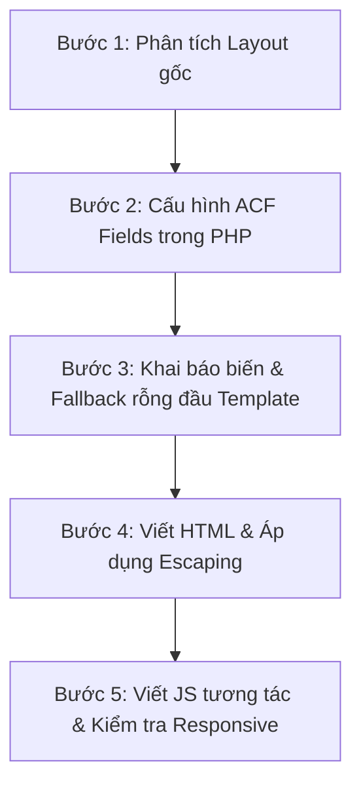

# Quy tắc & Tiêu chuẩn Phát triển Dự án WordPress (HTML/CSS + ACF)

Chào mừng bạn đến với tài liệu hướng dẫn quy tắc và luồng xử lý kỹ thuật của dự án. Tài liệu này được tổ chức theo mô hình mô-đun (tương tự SCSS) giúp quản lý và cập nhật quy tắc một cách độc lập và khoa học.

---

## Danh mục Quy tắc Phát triển Chi tiết

Vui lòng nhấp vào các liên kết bên dưới để xem chi tiết từng nhóm quy tắc:

### 1. [Quy ước Đặt tên & Cấu trúc Thư mục](file:///d:/xampp/htdocs/wordpress-acf/.agent/rules/naming-conventions.md)
* Quy ước đặt tên cho ACF Field Keys, Field Names, File Templates và assets.
* Tổ chức thư mục stylesheets (`assets/css/`, `assets/scss/`) và javascripts (`js/`).

### 2. [Quy tắc Cấu hình ACF (Advanced Custom Fields)](file:///d:/xampp/htdocs/wordpress-acf/.agent/rules/acf.md)
* Hướng dẫn khai báo Local Fields qua PHP (`acf_add_local_field_group`) trong file `inc/acf-fields.php`.
* Nguyên tắc chia Tab cấu hình và đăng ký hàm ACF Fallback tránh lỗi Fatal Error.

### 3. [Quy tắc HTML/CSS & Layout](file:///d:/xampp/htdocs/wordpress-acf/.agent/rules/html-css.md)
* Tiêu chuẩn tích hợp Tailwind CSS, biên dịch Sass (`npm run compile:css`) và quản lý file style riêng biệt cho từng trang.
* Cấu hình và thiết lập class CSS hoạt họa (`reveal-slide-up`).

### 4. [Quy tắc JavaScript & Tương tác (Interactions)](file:///d:/xampp/htdocs/wordpress-acf/.agent/rules/js-interactions.md)
* Tiêu chuẩn tương tác bằng JavaScript thuần (Vanilla JS) không phụ thuộc thư viện Next.js/React.
* Quy tắc đóng mở menu di động và kích hoạt hoạt họa reveal bằng `IntersectionObserver`.

### 5. [Quy tắc PHP Template & Bảo mật](file:///d:/xampp/htdocs/wordpress-acf/.agent/rules/php-security.md)
* Quy chuẩn nhận dữ liệu ACF ở đầu tệp template và thiết lập dữ liệu mặc định (fallback).
* Bảo mật đầu ra chống lỗ hổng XSS bằng các hàm escaping của WordPress (`esc_html`, `esc_url`, `wp_kses_post`, `esc_attr`).

### 6. [Vòng đời Xử lý Request trong WordPress (Request Lifecycle)](file:///d:/xampp/htdocs/wordpress-acf/.agent/rules/request-lifecycle.md)
* Sơ đồ tuần tự bằng Mermaid mô tả luồng xử lý của một request (từ lúc gửi request, routing, main query DB, nạp ACF fields cho tới khi enqueue assets và trả về HTML).

### 7. [Quy trình Xây dựng Website WordPress Cơ bản với ACF](file:///d:/xampp/htdocs/wordpress-acf/.agent/rules/website-build-workflow.md)
* Quy trình 3 bước tuần tự thiết lập và hoàn thiện website: Header/Footer, Trang tĩnh và Trang động.

### 8. [Nhật Ký Đánh Giá & Tối Ưu Hiệu Năng ACF](file:///d:/xampp/htdocs/wordpress-acf/acf-performance.md)
* Nhật ký benchmark đo lường hiệu năng từ baseline (145 queries, TTFB 850ms) đến kết quả đạt tiêu chuẩn (14 queries, TTFB 125ms, PageSpeed 99/100).

---

## Luồng Làm Việc Tiêu Chuẩn của AI Agent

Khi tiến hành tạo mới hoặc chỉnh sửa giao diện của một trang/thành phần, AI Agent bắt buộc phải tuân thủ nghiêm ngặt quy trình phát triển 5 bước sau:

1. **Bước 1 (Phân tích Layout gốc)**: Đọc tệp HTML/CSS/JS mẫu để phân tách các section cần động hóa và trích xuất style tĩnh.
2. **Bước 2 (Cấu hình ACF Fields)**: Khai báo nhóm trường ACF tương ứng và phân chia Tabs trong `inc/acf-fields.php`.
3. **Bước 3 (Gán nhận biến & Fallback)**: Kéo dữ liệu ACF lên đầu file Template PHP, thiết lập các fallback rỗng an toàn (chuỗi hoặc mảng rỗng) và viết kiểm tra rỗng ở template HTML.
4. **Bước 4 (Render HTML & Escape)**: Viết cấu trúc HTML đã được làm sạch, sử dụng các hàm escape an toàn của WordPress.
5. **Bước 5 (JS & Responsive)**: Viết JS tương tác thuần (nếu có), biên dịch CSS và kiểm tra responsive trên mobile.
