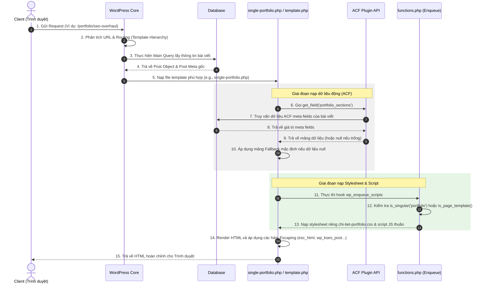

# Vòng đời Xử lý Request trong WordPress (Request Lifecycle)

Tài liệu này mô tả chi tiết luồng xử lý kỹ thuật của WordPress khi tiếp nhận một request từ Client, phối hợp với ACF và render template an toàn ra màn hình.

---

## Sơ đồ tuần tự Request Lifecycle & ACF

---

## Chi tiết các bước xử lý
1. **Routing**: WordPress Router phân tích request dựa trên quy tắc cấu hình permalink và xác định loại trang (Single Post, Page, Archive, v.v.).
2. **Main Query**: WordPress tự động chạy truy vấn mặc định để lấy dữ liệu bài viết tương ứng với URL trước khi gọi tệp template.
3. **Template Loading**: WordPress nạp file template PHP theo mức độ ưu tiên của Template Hierarchy (ví dụ: `single-portfolio.php` sẽ được chọn trước `single.php` đối với bài viết thuộc post type `portfolio`).
4. **ACF Integration**: Ở đầu template PHP, ACF API truy vấn các meta field riêng lẻ và trả về dữ liệu. Nếu admin chưa nhập dữ liệu, logic PHP sử dụng toán tử null coalescing (`?:`) để gán dữ liệu demo fallback.
5. **Enqueue assets**: Theme đăng ký tải CSS/JS riêng của trang bằng hook `wp_enqueue_scripts` trong file `functions.php` dựa trên template đang hoạt động để tối ưu hiệu năng tải trang.
6. **Escaped Rendering & Response**: Dữ liệu PHP được lọc qua các hàm escape trước khi in ra HTML và gửi về cho browser để đảm bảo tính an toàn chống lỗi XSS.