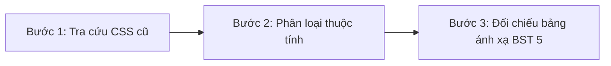

# Hướng dẫn Phương pháp Quy đổi & Ánh xạ Class CSS sang Bootstrap 5

Tài liệu này định nghĩa phương pháp so sánh các lớp (classes) CSS tùy biến cũ trên một phần tử với các lớp tiện ích mặc định của **Bootstrap 5 (BST 5)**, giúp xác định xem lớp nào có thể chuyển đổi hoàn toàn và lớp nào cần được giữ lại.

---

## 1. Quy trình 3 bước so sánh thuộc tính CSS



### Bước 1: Tra cứu CSS của class cũ
Mở tệp stylesheet tùy biến gốc (`.css`) và tìm quy tắc style của selector đó. 
*Ví dụ:* Ta có thẻ HTML `<div class="jjyab_a">`. Tra cứu CSS gốc của `.jjyab_a`:
```css
.jjyab_a {
    width: 100%;
    display: flex;
    justify-content: space-between;
}
```

### Bước 2: Phân loại các thuộc tính
Phân rã các dòng thuộc tính CSS trên thành các nhóm tính năng:
- Bố cục lưới / Flexbox: `display: flex; justify-content: space-between;`
- Chiều rộng: `width: 100%;`

### Bước 3: Đối chiếu với bảng thuộc tính Bootstrap 5
Tra cứu lớp tiện ích tương ứng của Bootstrap 5 có cùng thuộc tính CSS tương đương:
- `display: flex;` $\rightarrow$ `.d-flex`
- `justify-content: space-between;` $\rightarrow$ `.justify-content-between`
- `width: 100%;` $\rightarrow$ `.w-100` (hoặc dùng grid column mặc định của Bootstrap).

---

## 2. Bảng Đối chiếu Quy đổi thuộc tính thường gặp

| Thuộc tính CSS cũ (Tĩnh) | Giá trị mẫu | Lớp tiện ích Bootstrap 5 tương đương |
| :--- | :--- | :--- |
| **`float`** | `float: left;` / `float: right;` | Sử dụng Flexbox `.d-flex` hoặc Grid `.row` / `.col` |
| **`display`** | `display: flex;` | `.d-flex` |
| **`justify-content`** | `justify-content: space-between;` | `.justify-content-between` |
| **`align-items`** | `align-items: center;` | `.align-items-center` |
| **`text-align`** | `text-align: center;` / `text-align: left;` | `.text-center` / `.text-start` |
| **`width`** | `width: 100%;` / `width: 50%;` | `.w-100` / `.col-md-6` |
| **`margin`** | `margin-top: 20px;` / `margin-bottom: 30px;` | `.mt-3` / `.mb-4` (Quy đổi 1rem = 16px) |
| **`padding`** | `padding: 40px 0;` / `padding-left: 15px;` | `.py-5` / `.ps-3` |
| **`border-radius`** | `border-radius: 4px;` / `border-radius: 50%;` | `.rounded` / `.rounded-circle` |
| **`background-color`** | `background-color: #f8f8f8;` | `.bg-light` |

---

## 3. Nguyên tắc Xử lý Class (Chuyển đổi vs Giữ lại)

Khi so sánh thuộc tính, ta áp dụng nguyên tắc **"Tiếp cận Lớp lai" (Hybrid Class Approach)**:

1. **Thay thế hoàn toàn (Convert):**
   - Nếu lớp cũ *chỉ chứa* các thuộc tính căn lề, khoảng cách, float, ẩn/hiển thị đã có sẵn trong Bootstrap 5 (ví dụ: `.fl { float: left; }` hoặc `.clearfix`).
   - **Hành động:** Thay thế lớp đó bằng lớp Bootstrap 5 trong file HTML và xóa hẳn rule đó khỏi file CSS tùy biến.
2. **Sử dụng kết hợp (Hybrid):**
   - Nếu lớp cũ chứa cả các thuộc tính layout *và* thuộc tính trang trí thương hiệu (ví dụ: màu sắc độc quyền, ảnh nền chéo, hiệu ứng transition đặc biệt, bo viền đổ bóng phức tạp).
   - **Hành động:** Giữ lại tên lớp cũ để nhận CSS trang trí, đồng thời bổ sung thêm các lớp tiện ích của Bootstrap 5 để giải quyết phần layout/spacing.
   - **Ví dụ:** `<div class="jjybt fl">` $\rightarrow$ `<div class="jjybt col-md-6 order-md-1">` (Lớp `.jjybt` giữ lại để nhận CSS tùy biến về kích thước hình ảnh đặc thù, các lớp `.col-md-6 .order-md-1` xử lý căn lưới và thứ tự).
