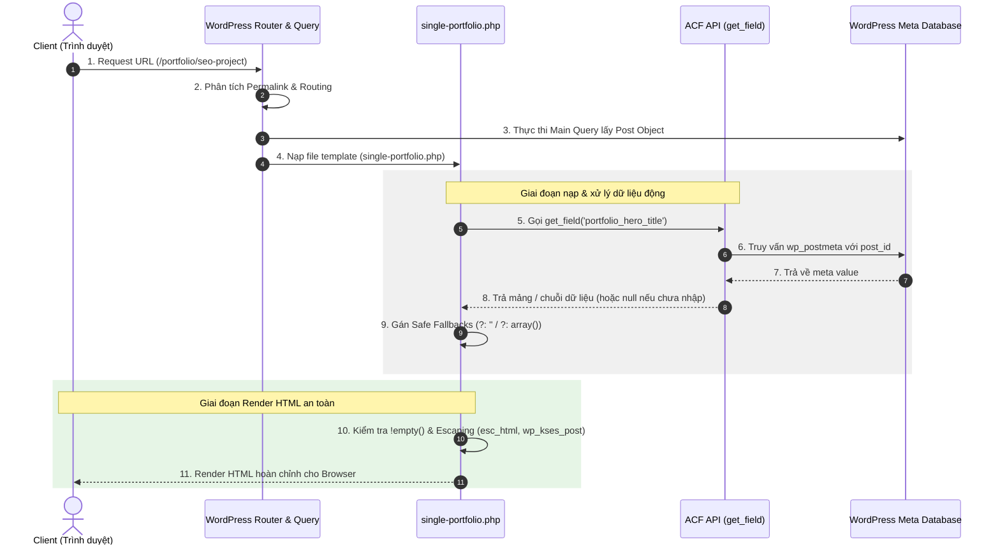

# Tài liệu Hướng dẫn & Kỹ năng Advanced Custom Fields (ACF) trong WordPress

Tài liệu này lưu trữ các kiến thức nền tảng, cú pháp chuẩn và nguyên tắc thực thi Advanced Custom Fields (ACF) trong phát triển dự án WordPress chuyên nghiệp.

---

## 1. Giới thiệu tổng quan về ACF

**Advanced Custom Fields (ACF)** là plugin hàng đầu trong hệ sinh thái WordPress giúp mở rộng khả năng quản trị dữ liệu thông qua việc bổ sung các trường dữ liệu tùy biến (Custom Fields / Meta Data).

### Vì sao chọn ACF?
* **Mở rộng linh hoạt**: Cho phép gắn dữ liệu tùy biến vào Post Types, Pages, Taxonomy Terms, Users, Media Attachments và Options Pages (Cấu hình trang chung).
* **Tối ưu trải nghiệm Admin**: Biến giao diện quản trị mặc định của WordPress thành một CMS chuyên nghiệp, trực quan và ngăn nắp.
* **Tách biệt dữ liệu và giao diện**: Giúp lưu trữ dữ liệu chuẩn hóa, dễ dàng truy vấn ngoài frontend và duy trì qua các phiên bản theme.

---

## 2. Hai Trụ Cột Cốt Lõi của ACF: Fields & Rules

Hệ thống ACF được xây dựng dựa trên 2 khái niệm cốt lõi: **Fields (Các trường dữ liệu)** và **Rules (Các quy tắc vị trí & điều kiện)**.

```
                  ┌─────────────────────────────────────────┐
                  │        ADVANCED CUSTOM FIELDS           │
                  └────────────────────┬────────────────────┘
                                       │
            ┌──────────────────────────┴──────────────────────────┐
            ▼                                                     ▼
┌───────────────────────┐                             ┌───────────────────────┐
│     1. ACF FIELDS     │                             │     2. ACF RULES      │
│ (Trường dữ liệu nhập) │                             │(Quy tắc hiển thị UI)  │
└───────────┬───────────┘                             └───────────┬───────────┘
            │                                                     │
 ├─ Basic (Text, Number)                               ├─ Location Rules
 ├─ Content (Wysiwyg, Image)                           │  (Xuất hiện ở đâu trong Admin)
 ├─ Choice (Select, Switch)                            │
 ├─ Relational (Post, Taxonomy)                        └─ Conditional Logic Rules
 ├─ Layout (Tab, Repeater, Flex)                          (Phụ thuộc giữa các Field)
 └─ jQuery (DatePicker, Color)
```

---

### 🎯 Trụ cột 1: Các Trường Dữ Liệu (ACF Fields)

Fields định nghĩa cấu trúc dữ liệu mà người quản trị (Admin) sẽ nhập vào. Mỗi Field gồm các thuộc tính quan trọng:
* `key`: Định danh duy nhất (ví dụ: `field_portfolio_title`).
* `label`: Nhãn hiển thị trong Admin (ví dụ: `Tiêu đề dự án`).
* `name`: Tên biến lưu vào Meta Database (ví dụ: `portfolio_title`).
* `type`: Loại trường (ví dụ: `text`, `image`, `repeater`).

#### Phân loại 6 nhóm Field chính trong ACF:

#### 1. Nhóm Trường Cơ Bản (Basic Fields)
* **Text (`text`)**: Chuỗi ngắn đơn dòng (Tiêu đề phụ, Mã sản phẩm, Hotline, Slogan).
* **Textarea (`textarea`)**: Văn bản nhiều dòng (Mô tả ngắn, địa chỉ, trích dẫn). Nên dùng kết hợp `wpautop()` khi render nếu cần tự tạo thẻ đoạn văn.
* **Number (`number`)**: Nhập số nguyên hoặc số thực (Giá tiền, Số lượng, Điểm đánh giá).
* **Range (`range`)**: Thanh trượt chọn khoảng số ngầm định.
* **Email (`email`) / URL (`url`)**: Nhập email hoặc đường dẫn web với tính năng tự động kiểm tra định dạng (validation).
* **Password (`password`)**: Nhập chuỗi ký tự ẩn (mật khẩu).

#### 2. Nhóm Nội dung & Media (Content Fields)
* **Image (`image`)**: Tải lên hoặc chọn ảnh từ thư viện Media Library.
  * **Cấu hình bắt buộc**: Luôn chọn `'return_format' => 'array'` hoặc `'id'`. **Cấm** dùng `'return_format' => 'url'` để đảm bảo gọi được hàm `wp_get_attachment_image()` tự động hỗ trợ Responsive Image (`srcset`) và thẻ SEO `alt`.
* **File (`file`)**: Tải tệp tài liệu đính kèm (PDF, DOCX, ZIP...).
* **WYSIWYG Editor (`wysiwyg`)**: Trình soạn thảo văn bản phong phú (Word-like editor) cho phép in đậm, nghiêng, gắn liên kết, tạo danh sách.
  * **Lưu ý render**: Xuất ra ngoài PHP sử dụng `wp_kses_post($content)`, **không** bọc thêm `wpautop()` vì WYSIWYG đã tự động sinh các thẻ `<p>` và `<br>`.
* **oEmbed (`oembed`)**: Nhúng tự động video YouTube, Vimeo, bài hát SoundCloud thông qua URL.
* **Gallery (`gallery`)**: Bộ sưu tập chọn nhiều hình ảnh cùng lúc (thích hợp làm Slider, Album ảnh).

#### 3. Nhóm Lựa chọn (Choice Fields)
* **Select (`select`)**: Menu thả xuống chọn 1 hoặc nhiều tùy chọn.
* **Checkbox (`checkbox`)**: Các ô tích chọn nhiều giá trị đồng thời.
* **Radio Button (`radio`)**: Nút chọn 1 giá trị duy nhất trong danh sách lựa chọn.
* **Button Group (`button_group`)**: Nhóm nút bấm phẳng cho phép chọn nhanh giá trị.
* **True / False (`true_false`)**: Nút bật/tắt (Toggle Switch) để cấu hình ẩn/hiện hoặc bật tính năng.
  * **Cấu hình bắt buộc**: Luôn thiết lập `'ui' => 1` để hiển thị giao diện công tắc gạt trực quan.

#### 4. Nhóm Quan hệ (Relational Fields)
* **Post Object (`post_object`)**: Chọn 1 hoặc nhiều bài viết/trang/CPT để liên kết dữ liệu.
* **Page Link (`page_link`)**: Chọn bài viết và chỉ lấy ra đường dẫn URL của bài đó.
* **Relationship (`relationship`)**: Chọn liên kết các bài viết với giao diện 2 cột kéo thả chuyên nghiệp.
* **Taxonomy (`taxonomy`)**: Chọn Chuyên mục (Category), Thẻ (Tag) hoặc Custom Taxonomy.
* **User (`user`)**: Chọn tài khoản người dùng/tác giả trong hệ thống.

#### 5. Nhóm Bố cục & Cấu trúc (Layout Fields)
* **Tab (`tab`)**: Bắt buộc dùng để chia Field Group thành các Tab ngăn nắp (Top/Left) khi trang chứa nhiều Section.
* **Accordion (`accordion`)**: Thu gọn/mở rộng nhóm trường theo dạng cuộn đứng.
* **Group (`group`)**: Gom nhóm các trường thành 1 mảng dữ liệu lồng nhau trong Database.
* **Repeater (`repeater`)**: Tạo danh sách dữ liệu lặp đi lặp lại (Danh sách tính năng, FAQ, Đối tác).
  * *Thuộc tính*: Ưu tiên `layout => 'table'` cho ít trường, `layout => 'row'` hoặc `'block'` cho nhiều trường. Thiết lập `collapsed` trỏ về tiêu đề con để thu gọn khi sửa.
* **Flexible Content (`flexible_content`)**: Ma trận cho phép Admin tự do chọn, thêm/bớt và sắp xếp thứ tự các Block Layout khác nhau trên từng trang.

#### 6. Nhóm Nâng cao (jQuery / Advanced Fields)
* **Date Picker (`date_picker`)**: Ô chọn ngày (dạng YYYY-MM-DD).
* **Date Time Picker (`date_time_picker`)**: Ô chọn cả ngày và giờ.
* **Time Picker (`time_picker`)**: Ô chọn giờ.
* **Color Picker (`color_picker`)**: Bảng mã màu sắc HEX / RGBA.
* **Google Map (`google_map`)**: Bản đồ tương tác chọn vị trí tọa độ Latitude / Longitude.

---

### 🎯 Trụ cột 2: Quy Tắc Hiển Thị (ACF Rules)

Rules quyết định **KHI NÀO** và **Ở ĐÂU** các Field Groups hoặc các Field con cụ thể được phép xuất hiện. ACF chia làm 2 loại Rule chính:

#### A. Location Rules (Quy tắc Vị trí hiển thị của Field Group)
Location Rules định nghĩa Field Group sẽ hiển thị ở màn hình quản trị nào trong WP Admin.

* **Các tham số vị trí chính**:
  1. **Post / Page / Custom Post Type**:
     * `post_type == portfolio` (Chỉ hiện khi chỉnh sửa Post Type Portfolio).
     * `page_template == templates/template-home.php` (Chỉ hiện khi Page chọn Template Trang chủ).
     * `post_category == news` (Chỉ hiện khi bài viết thuộc chuyên mục News).
  2. **Taxonomy Terms**:
     * `taxonomy == category` hoặc `taxonomy == portfolio_cat` (Hiển thị khi sửa danh mục).
  3. **Users**:
     * `user_form == edit` hoặc `user_role == administrator` (Hiển thị khi sửa thông tin User).
  4. **Options Page**:
     * `options_page == theme-general-settings` (Hiển thị trong trang Cấu hình Theme).

* **Nguyên tắc Logic AND và OR trong Code Location**:
  * **Mảng cùng cấp (Logic AND)**: Tất cả điều kiện phải ĐÚNG cùng lúc.
  * **Mảng đa cấp (Logic OR)**: Chỉ cần 1 mảng điều kiện ĐÚNG là đủ.

```php
'location' => array(
    // Điều kiện Group 1 (AND): Post type là 'portfolio' VÀ chọn template 'single-portfolio.php'
    array(
        array(
            'param'    => 'post_type',
            'operator' => '==',
            'value'    => 'portfolio',
        ),
        array(
            'param'    => 'page_template',
            'operator' => '==',
            'value'    => 'single-portfolio.php',
        ),
    ),
    // HOẶC (OR) Điều kiện Group 2: Trang có ID là 15 (Trang About Us)
    array(
        array(
            'param'    => 'page',
            'operator' => '==',
            'value'    => '15',
        ),
    ),
),
```

#### B. Conditional Logic Rules (Quy tắc Hiển thị Phụ thuộc giữa các Field)
Conditional Logic dùng để Ẩn / Hiện một Field con dựa trên giá trị được chọn từ một Field khác.

* **Ví dụ thực tế**: Chỉ khi Admin gạt nút `Trạng thái Hero Button` (`true_false`) sang ON (1) thì 2 trường `Nhãn nút` (`text`) và `Link nút` (`url`) mới xuất hiện.

```php
'conditional_logic' => array(
    array(
        array(
            'field'    => 'field_hero_enable_button', // Key của field công tắc
            'operator' => '==',
            'value'    => '1',
        ),
    ),
),
```

---

## 3. Khai báo Local Fields qua Code PHP (Kỹ thuật chuẩn)

Theo quy định dự án, toàn bộ ACF Field Groups phải được khai báo trực tiếp trong mã nguồn PHP qua hàm `acf_add_local_field_group()` trong tệp `inc/acf-fields.php` để dễ dàng quản lý qua Git.

### 📌 Mẫu Khai Báo PHP Chuẩn

```php
if ( function_exists( 'acf_add_local_field_group' ) ) {
    acf_add_local_field_group( array(
        'key'                   => 'group_portfolio_detail',
        'title'                 => 'Cấu hình Chi tiết Portfolio',
        'fields'                => array(
            
            // TAB 1: HERO SECTION
            array(
                'key'       => 'field_tab_portfolio_hero',
                'label'     => 'Hero Section',
                'type'      => 'tab',
                'placement' => 'top',
            ),
            array(
                'key'           => 'field_portfolio_hero_title',
                'label'         => 'Tiêu đề Hero',
                'name'          => 'portfolio_hero_title',
                'type'          => 'text',
                'instructions'  => 'Nhập tiêu đề chính hiển thị ở đầu bài viết.',
            ),
            array(
                'key'           => 'field_portfolio_hero_image',
                'label'         => 'Hình ảnh Hero',
                'name'          => 'portfolio_hero_image',
                'type'          => 'image',
                'return_format' => 'array',
                'preview_size'  => 'medium',
            ),

            // TAB 2: REPEATER BỘ BỘ SƯU TẬP
            array(
                'key'       => 'field_tab_portfolio_gallery',
                'label'     => 'Bộ sưu tập',
                'type'      => 'tab',
                'placement' => 'top',
            ),
            array(
                'key'          => 'field_portfolio_gallery_list',
                'label'        => 'Danh sách ảnh chi tiết',
                'name'         => 'portfolio_gallery_list',
                'type'         => 'repeater',
                'layout'       => 'block',
                'button_label' => 'Thêm ảnh dự án',
                'sub_fields'   => array(
                    array(
                        'key'           => 'field_gallery_item_image',
                        'label'         => 'Hình ảnh',
                        'name'          => 'image',
                        'type'          => 'image',
                        'return_format' => 'array',
                    ),
                    array(
                        'key'           => 'field_gallery_item_caption',
                        'label'         => 'Chú thích ảnh',
                        'name'          => 'caption',
                        'type'          => 'text',
                    ),
                ),
            ),
        ),
        'location'              => array(
            array(
                array(
                    'param'    => 'post_type',
                    'operator' => '==',
                    'value'    => 'portfolio',
                ),
            ),
        ),
        'menu_order'            => 0,
        'position'              => 'normal',
        'style'                 => 'default',
        'label_placement'       => 'top',
        'instruction_placement' => 'label',
    ) );
}
```

---

## 4. Các Điều Kiện & Nguyên Tắc Khi Thao Tác Với ACF

Khi thao tác với ACF trong code PHP (từ khai báo, lấy dữ liệu đến hiển thị ngoài Frontend), lập trình viên bắt buộc tuân thủ 5 nhóm điều kiện kỹ thuật sau:

### 4.1. Điều kiện Ngữ cảnh Lấy Dữ liệu (Contextual Target Conditions)
Hàm `get_field()` và `the_field()` cần được truyền đúng tham số ID ngữ cảnh tùy theo vị trí lưu trữ dữ liệu:

* **Bài viết / Trang trong Main Loop**: `get_field('field_name')` (WordPress tự lấy ID của bài viết hiện tại).
* **Bài viết / Custom Post Type ngoài Loop (Custom Query / Widget / AJAX)**: Bắt buộc truyền `$post_id` cụ thể $\rightarrow$ `get_field('field_name', $post->ID)`.
* **Trang Cấu hình Chung (Options Page)**: Truyền chuỗi `'option'` $\rightarrow$ `get_field('field_name', 'option')`.
* **Danh mục / Taxonomy Term**: Truyền chuỗi `'term_' . $term_id` hoặc đối tượng term $\rightarrow$ `get_field('field_name', 'term_' . $term_id)`.
* **Thông tin Người dùng (User Profile)**: Truyền chuỗi `'user_' . $user_id` $\rightarrow$ `get_field('field_name', 'user_' . $user_id)`.
* **Bình luận (Comment)**: Truyền chuỗi `'comment_' . $comment_id` $\rightarrow$ `get_field('field_name', 'comment_' . $comment_id)`.
* **Tệp Đa phương tiện (Media Attachment)**: Truyền ID của tệp media $\rightarrow$ `get_field('field_name', $attachment_id)`.
* **Gutenberg Block Custom**: `get_field('field_name')` (Tự động nhận context của block trong callback render).

### 4.2. Điều kiện Kiểm tra Sự Tồn Tại Plugin (Plugin Existence Condition)
Phòng trường hợp Admin vô hiệu hóa plugin ACF, code PHP ngoài frontend không được gọi trực tiếp hàm `get_field()` mà chưa qua kiểm tra hoặc fallback.
```php
// Cách 1: Kiểm tra trực tiếp trước khi gọi
if ( function_exists( 'get_field' ) ) {
    $value = get_field( 'field_name' );
}

// Cách 2 (Khuyên dùng): Đăng ký hàm Fallback sẵn trong functions.php (Xem Mục 6)
```

### 4.3. Điều kiện Khống chế Kiểu Dữ Liệu & Safe Fallbacks (PHP 8.1+ Condition)
Từ PHP 8.1+, truyền giá trị `null` vào các hàm xử lý chuỗi/mảng ngầm định của WordPress sẽ gây ra lỗi `Deprecated: Passing null to parameter...`.
* **Điều kiện bắt buộc**: Luôn gán Safe Fallback về kiểu rỗng chuẩn (`?: ''` cho text/url, `?: array()` cho repeater/image/gallery/select) ngay lúc gọi `get_field()`.

### 4.4. Điều kiện Hiển thị Giao diện UI (UI Render Visibility Conditions)
Bắt buộc bọc điều kiện kiểm tra dữ liệu `if ( ! empty(...) )` trước khi kết xuất bất kỳ thẻ HTML nào ngoài frontend:
* **Section có trường đơn (Hero, CTA, Quote...)**: Chỉ hiển thị khi ít nhất một trong các trường nòng cốt (Tiêu đề hoặc Mô tả) không rỗng: `if ( ! empty( $title ) || ! empty( $desc ) )`.
* **Section dạng Danh sách (Repeater, Gallery, Select multiple...)**: Chỉ hiển thị khi mảng dữ liệu danh sách không rỗng: `if ( ! empty( $items ) )`.
* **Mỗi phần tử con trong Loop (Sub-item Condition)**: Bắt buộc kiểm tra trường bắt buộc của phần tử con (như `empty($item['image']['id'])`), dùng `continue` để bỏ qua các dòng dữ liệu rỗng nếu Admin lỡ bấm thêm hàng nhưng không nhập thông tin.

### 4.5. Điều kiện Format Giá trị (`$format_value` Condition)
Hàm `get_field( $selector, $post_id, $format_value )` nhận tham số thứ 3 là boolean:
* `$format_value = true` (Mặc định): Trả về giá trị đã qua ACF format (đối tượng Ảnh dạng Array, Ngày định dạng d/m/Y).
* `$format_value = false` (Lấy dữ liệu thô): Trả về giá trị thô lưu trong Meta DB (ID Ảnh dạng int, Ngày dạng YYYYMMDD). Thích hợp khi cần viết SQL query hoặc xử lý tính toán số học thô.

---

### 💻 Ví dụ Code Template PHP Chuẩn (Áp dụng đầy đủ các Điều kiện)

```php
<?php
/**
 * single-portfolio.php - Template render dữ liệu ACF chuẩn hóa
 */

// Step 1: Lấy dữ liệu ACF kèm Safe Fallbacks
$hero_title = get_field( 'portfolio_hero_title' ) ?: '';
$hero_image = get_field( 'portfolio_hero_image' ) ?: array();
$gallery    = get_field( 'portfolio_gallery_list' ) ?: array();

// Step 2: Render Hero Section (Chỉ hiển thị khi có Tiêu đề hoặc Ảnh)
if ( ! empty( $hero_title ) || ! empty( $hero_image ) ) :
?>
    <section class="portfolio-hero">
        <div class="container">
            <?php if ( ! empty( $hero_title ) ) : ?>
                <h1 class="hero-title"><?php echo esc_html( $hero_title ); ?></h1>
            <?php endif; ?>

            <?php if ( ! empty( $hero_image['id'] ) ) : ?>
                <div class="hero-image-wrap">
                    <?php echo wp_get_attachment_image( $hero_image['id'], 'full', false, array( 'class' => 'hero-img' ) ); ?>
                </div>
            <?php endif; ?>
        </div>
    </section>
<?php 
endif;

// Step 3: Render Repeater Section (Chỉ hiển thị khi danh sách ảnh không rỗng)
if ( ! empty( $gallery ) ) :
?>
    <section class="portfolio-gallery">
        <div class="container grid grid-cols-3">
            <?php foreach ( $gallery as $item ) : 
                $img     = $item['image'] ?: array();
                $caption = $item['caption'] ?: '';

                // Bỏ qua item nếu không chọn ảnh
                if ( empty( $img['id'] ) ) {
                    continue;
                }
            ?>
                <div class="gallery-item">
                    <?php echo wp_get_attachment_image( $img['id'], 'medium_large', false, array( 'class' => 'gallery-img' ) ); ?>
                    <?php if ( ! empty( $caption ) ) : ?>
                        <p class="caption"><?php echo esc_html( $caption ); ?></p>
                    <?php endif; ?>
                </div>
            <?php endforeach; ?>
        </div>
    </section>
<?php endif; ?>
```

---

## 5. Đăng ký ACF Fallback Functions phòng ngừa sự cố

Trong file `functions.php`, luôn đăng ký hàm fallback cho `get_field()` và `the_field()` để nếu plugin ACF lỡ bị Admin tắt ngoài ý muốn thì giao diện trang web vẫn hoạt động bình thường mà không bị crash lỗi fatal.

```php
add_action( 'after_setup_theme', 'project_acf_fallback_functions', 20 );
function project_acf_fallback_functions() {
    if ( ! is_admin() ) {
        if ( ! function_exists( 'get_field' ) ) {
            function get_field( $selector, $post_id = false, $format_value = true ) {
                return false;
            }
        }
        if ( ! function_exists( 'the_field' ) ) {
            function the_field( $selector, $post_id = false, $format_value = true ) {
                echo get_field( $selector, $post_id, $format_value );
            }
        }
    }
}
```

---

## 6. Sơ đồ Tuần Tự Request Lifecycle & ACF Integration


