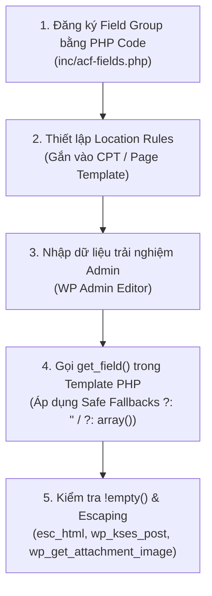

# Cây Kiến Thức Advanced Custom Fields (ACF Tree)

Tài liệu này hệ thống hóa toàn bộ kiến thức về **Advanced Custom Fields (ACF)** dưới dạng cây sơ đồ tư duy (Mindmap & Knowledge Tree) trực quan, chi tiết và chuẩn hóa theo kiến trúc phát triển WordPress chuyên nghiệp.

---

## 🌳 1. Sơ Đồ Cây Tổng Quan (Mermaid Mindmap)

```mermaid
mindmap
  root((ACF KNOWLEDGE TREE))
    Architecture & Storage
      DB Storage
        wp_postmeta
        wp_termmeta
        wp_usermeta
        wp_options
      Declaration Methods
        PHP Local Fields acf_add_local_field_group
        Local JSON Sync
        Database GUI Admin
      Safety Guards
        Fallback Functions in functions.php
    Field System 30+ Fields
      Basic
        Text
        Textarea
        Number
        Range
        Email / URL / Password
      Content Media
        Image array / id
        File
        Wysiwyg wp_kses_post
        oEmbed
        Gallery
      Choice
        Select
        Checkbox / Radio
        Button Group
        True False ui => 1
      Relational
        Post Object
        Page Link
        Relationship 2-column
        Taxonomy
        User
      Layout
        Tab top / left
        Group
        Repeater row / table / block
        Flexible Content
        Accordion
      jQuery Advanced
        Date / Time Picker
        Color Picker
        Google Map
    Rules Engine
      Location Rules
        Post Type / Page Template
        Taxonomy Terms
        User Edit / Roles
        Options Pages
        Logic AND Same array
        Logic OR Nested array
      Conditional Logic
        Show / Hide Field B
        Based on Field A Value
    PHP API & Frontend
      Single Values
        get_field
        the_field
      Loop Iteration
        have_rows / the_row
        get_sub_field
      Object Metadata
        get_field_object
        update_field
    Best Practices & Security
      Safe Fallbacks PHP 8.1+
        Null Coalescing ?: '' / ?: array()
      Empty Guards
        if !empty Section / Item
      Output Escaping
        esc_html / esc_url / wp_kses_post
        wp_get_attachment_image
      No Static Mock Data
```

---

## 🌲 2. Sơ Đồ Cây Chi Tiết (ASCII Knowledge Tree)

```
ACF KNOWLEDGE TREE
├── 1. ARCHITECTURE & DATA STORAGE (Kiến trúc & Lưu trữ Dữ liệu)
│   ├── Database Schema (Lưu trữ Database)
│   │   ├── Post Meta ─────────────► wp_postmeta (meta_key = field_name, _meta_key = field_key)
│   │   ├── Term Meta ─────────────► wp_termmeta (taxonomy terms)
│   │   ├── User Meta ─────────────► wp_usermeta (user profile fields)
│   │   └── Option Meta ───────────► wp_options (theme options page)
│   ├── Registration Strategy (Phương thức Khai báo)
│   │   ├── PHP Code (Bắt buộc) ──► acf_add_local_field_group() trong inc/acf-fields.php (Git Versioning)
│   │   ├── Local JSON ────────────► Đồng bộ tự động qua folder /acf-json
│   │   └── DB Admin UI ───────────► Không khuyến nghị (khó quản lý môi trường Staging/Prod)
│   └── System Crash Guard (Phòng chống sự cố Fatal Error)
│       └── Fallback Functions ───► function_exists('get_field') guard trong functions.php
│
├── 2. FIELDS SYSTEM (Thứ bậc 6 Nhóm Trường Dữ liệu)
│   ├── Basic (Trường Cơ Bản)
│   │   ├── text ──────────────────► Chuỗi ngắn đơn dòng (Title, Subtitle, SKU, Hotline)
│   │   ├── textarea ──────────────► Văn bản nhiều dòng (Dùng kết hợp wpautop() khi cần)
│   │   ├── number / range ────────► Số nguyên/thực, chọn khoảng slider
│   │   └── email / url / password ► Kiểm tra định dạng tự động (Validation)
│   ├── Content & Media (Nội dung & Đa phương tiện)
│   │   ├── image ─────────────────► Trả về array/id (Cấm dùng url) -> wp_get_attachment_image()
│   │   ├── file ──────────────────► Tệp đính kèm (PDF, DOCX, ZIP)
│   │   ├── wysiwyg ───────────────► Editor giàu định dạng -> Render qua wp_kses_post()
│   │   ├── oembed ────────────────► Tự động nhúng Video YouTube, Vimeo, SoundCloud
│   │   └── gallery ───────────────► Bộ sưu tập mảng nhiều ảnh
│   ├── Choice (Trường Lựa chọn)
│   │   ├── select / radio ────────► Menu thả xuống / Chọn 1 nút
│   │   ├── checkbox ──────────────► Tích chọn nhiều giá trị
│   │   ├── button_group ──────────► Nhóm nút bấm phẳng chọn nhanh
│   │   └── true_false ────────────► Công tắc Bật/Tắt (Bắt buộc cấu hình 'ui' => 1)
│   ├── Relational (Trường Quan hệ Liên kết)
│   │   ├── post_object ───────────► Liên kết 1 hoặc nhiều Post/Page/CPT
│   │   ├── page_link ─────────────► Chỉ lấy URL đường dẫn của bài viết chọn
│   │   ├── relationship ──────────► Giao diện 2 cột kéo thả liên kết bài viết
│   │   ├── taxonomy ──────────────► Chọn Chuyên mục / Tag / Custom Taxonomies
│   │   └── user ──────────────────► Liên kết tài khoản User/Author
│   ├── Layout (Trường Bố cục & Cấu trúc)
│   │   ├── tab ───────────────────► Chia Field Group thành các Tab (top/left) ngăn nắp
│   │   ├── group ─────────────────► Mảng lồng nhau gom nhóm dữ liệu
│   │   ├── repeater ──────────────► Danh sách lặp (layout: table/row/block, collapsed)
│   │   ├── flexible_content ──────► Ma trận chọn & sắp xếp các Block Layout linh hoạt
│   │   └── accordion ─────────────► Thu gọn/mở rộng nhóm trường theo chiều ngang/dọc
│   └── jQuery / Advanced (Trường Nâng cao)
│       ├── date / time picker ────► Chọn Ngày (YYYY-MM-DD), Giờ, Ngày & Giờ
│       ├── color_picker ──────────► Chọn mã màu sắc HEX / RGBA
│       └── google_map ────────────► Tọa độ vị trí Latitude / Longitude
│
├── 3. RULES ENGINE (Động cơ Quy tắc ACF)
│   ├── Location Rules (Quy tắc Vị trí hiển thị Field Group)
│   │   ├── Target Entities (Đối tượng áp dụng)
│   │   │   ├── Post Type ─────────► post_type == 'portfolio' | 'post' | 'page'
│   │   │   ├── Page Template ─────► page_template == 'templates/template-home.php'
│   │   │   ├── Taxonomy Term ─────► taxonomy == 'category' | 'portfolio_cat'
│   │   │   ├── User Role ─────────► user_role == 'administrator' | user_form == 'edit'
│   │   │   └── Options Page ──────► options_page == 'theme-general-settings'
│   │   └── Condition Logic Operators (Phép toán Logic)
│   │       ├── Logic AND ─────────► Các điều kiện NẰM CÙNG MẢNG (Tất cả phải ĐÚNG)
│   │       └── Logic OR ──────────► Các mảng điều kiện NẰM RIÊNG BIỆT (Chỉ cần 1 mảng ĐÚNG)
│   └── Conditional Logic Rules (Quy tắc Phụ thuộc giữa các Field)
│       └── Field Dependency ──────► Ẩn/Hiện Field B dựa trên giá trị Field A (e.g. true_false == 1)
│
├── 4. PHP API & TARGET CONTEXTS (Cú pháp Lấy Dữ liệu Theo Ngữ Cảnh)
│   ├── Target Context Parameters ($post_id)
│   │   ├── Post/Page in Loop ───────► get_field('name') (Mặc định ID hiện tại)
│   │   ├── Post/CPT Custom Query ──► get_field('name', $post->ID)
│   │   ├── Options Page ────────────► get_field('name', 'option')
│   │   ├── Taxonomy Term ───────────► get_field('name', 'term_' . $term_id)
│   │   ├── User Profile ────────────► get_field('name', 'user_' . $user_id)
│   │   ├── Comment ─────────────────► get_field('name', 'comment_' . $comment_id)
│   │   └── Media Attachment ────────► get_field('name', $attachment_id)
│   ├── API Functions
│   │   ├── Single Value ────────────► get_field() / the_field()
│   │   ├── Loop Iteration ──────────► have_rows() / the_row() / get_sub_field()
│   │   └── Raw Metadata ────────────► get_field_object() / get_field('name', $id, false)
│   
└── 5. 5 CORE CONDITIONS & BEST PRACTICES (5 Nhóm Điều Kiện Kỹ Thuật Bắt Buộc)
    ├── 1. Plugin Guard Condition ───► function_exists('get_field') / fallback guard
    ├── 2. Context ID Condition ─────► Bắt buộc truyền $post_id khi ngoài Main Loop / Option / Term
    ├── 3. Safe Fallback Condition ──► Null Coalescing (?: '' / ?: array()) khống chế warning PHP 8.1+
    ├── 4. UI Visibility Conditions
    │   ├── Section Level ──────────► if ( ! empty($title) || ! empty($desc) )
    │   ├── List Level ─────────────► if ( ! empty($items) ) { foreach ... }
    │   └── Sub-item Level ─────────► if ( empty($item['image']['id']) ) continue;
    └── 5. Format Value Condition ──► $format_value = true (Array/Formatted) vs false (Raw DB ID/String)
```

---

## 🔍 3. Ma Trận Tra Cứu Nhanh (Quick Reference Matrix)

| Nhóm Field | Loại Field (`type`) | Format Trả Về Khuyên Dùng | Hàm Escape / Render Chuẩn | Trường Hợp Sử Dụng |
| :--- | :--- | :--- | :--- | :--- |
| **Basic** | `text` | String | `esc_html( $val )` | Tiêu đề, Hotline, Mã SP, Slogan |
| **Basic** | `textarea` | String | `wpautop( esc_html( $val ) )` | Mô tả ngắn, Trích dẫn |
| **Content** | `image` | `'return_format' => 'array'` | `wp_get_attachment_image( $img['id'], 'full' )` | Banner, Logo, Avatar |
| **Content** | `wysiwyg` | String (HTML) | `wp_kses_post( $val )` | Nội dung chi tiết bài viết, Case Study |
| **Choice** | `true_false` | Boolean (0/1) | `if ( $val )` | Công tắc Bật/Tắt Section, Toggle viền |
| **Choice** | `select` | String / Array | `esc_html( $val )` | Chọn layout style (Dark/Light), Cột |
| **Relational**| `post_object` | Post Object / ID | `setup_postdata( $post )` / `get_permalink()` | Bài viết liên quan, Sản phẩm kèm theo |
| **Relational**| `taxonomy` | Term Object / ID | `esc_html( $term->name )` | Gắn chuyên mục tùy biến |
| **Layout** | `tab` | N/A (Admin UI) | N/A | Chia tab giao diện Admin gọn gàng |
| **Layout** | `repeater` | Array of Arrays | `foreach ($val as $item)` | Danh sách FAQ, Danh sách Đối tác |
| **Layout** | `flexible_content`| Array of Layouts | `switch ($layout['acf_fc_layout'])` | Trang Builder tùy chỉnh nhiều Block |

---

## ⚡ 4. Quy Trình 5 Bước Triển Khai ACF Chuẩn Dự Án



---

## 🛡️ 5. Cheat Sheet Cú Pháp PHP Thường Dùng

### A. Lấy trường Text / Image đơn giản
```php
$title = get_field( 'hero_title' ) ?: '';
$image = get_field( 'hero_image' ) ?: array();

if ( ! empty( $title ) ) {
    echo '<h1>' . esc_html( $title ) . '</h1>';
}
if ( ! empty( $image['id'] ) ) {
    echo wp_get_attachment_image( $image['id'], 'full', false, array( 'class' => 'hero-img' ) );
}
```

### B. Duyệt qua mảng Repeater
```php
$features = get_field( 'feature_list' ) ?: array();

if ( ! empty( $features ) ) :
    echo '<ul class="feature-list">';
    foreach ( $features as $item ) :
        $item_title = $item['title'] ?: '';
        $item_icon  = $item['icon'] ?: array();

        if ( empty( $item_title ) ) continue; // Skip item trống
        ?>
        <li class="feature-item">
            <?php if ( ! empty( $item_icon['id'] ) ) echo wp_get_attachment_image( $item_icon['id'], 'thumbnail' ); ?>
            <span><?php echo esc_html( $item_title ); ?></span>
        </li>
        <?php
    endforeach;
    echo '</ul>';
endif;
```

### C. Duyệt qua Flexible Content
```php
$sections = get_field( 'page_sections' ) ?: array();

if ( ! empty( $sections ) ) {
    foreach ( $sections as $section ) {
        $layout = $section['acf_fc_layout'];

        if ( $layout === 'hero_block' ) {
            // Render hero block template
        } elseif ( $layout === 'cta_block' ) {
            // Render cta block template
        }
    }
}
```
